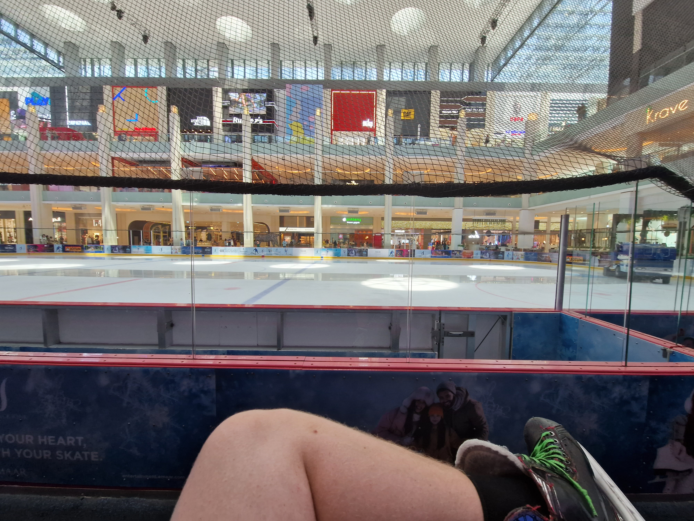

V červnu roku 2023 jsme se rozhodli navštívit Spojené arabské emiráty. Jedna letenky nás stála 4 tisíce od Wizzairu z Krakowa do Abu Dhabi a kupovali jsme je v lednu.  

## Cesta  
Cestu jsme zahájili kolem 6 ráno, kdy jsme vyjeli z Frýdku. Cesta do Krakowa trvá asi 2 hodiny a proběhla v pohodě. Parkoviště jsem měl zakoupeno na strankách letiště několik týdnu dopředu za 250.00 zł na 8 dní. Na letišti jsme byli 2 hodiny před odletem. Najít parkoviště nám dalo docela práci, ale definitivně nejnáročnější bylo přijít na to, jak se dostat přes závoru na dané parkoviště. Bylo potřeba, abychom šli do budky, kde slečna naskenovala lístek, který jsme dostali u vjezdu a mohli jsme pokračovat na dané parkoviště.  
  
Průchod letištěm byl bezproblémový, letenky jsme měli v aplikaci a nebyl to problém. Před kontrolou mi přišla zpráva o tom, že náš let bude mít dvě hodiny zpoždění, což nás potěšilo - mohli jsme jít na pivo. Na letišti měli i Plzeň. Potom jsme prošli kontrolou pasů pro let mimo Schengenský prostor, což bych udělal až "na poslední" chvíli, protože zde není Plzeň ;).  
  
Místo v letadle bylo dostatečné, není to luxus, ale těch 6 hodin se dalo v pohodě zvládnout. Coca-cola stojí 3€. V menu s bagetou a čokoládou za 9 €. Menu nedoporučuji. Bageta nebyla vůbec dobrá.  
  
Po přistání do Abu Dhabi jsme byli autobusem dopraveni do terminálu a dlouhými chodbami k pasové kontrole. Pokud jste už někdy byli v UAE tak můžete jít přes e-kontrolu, která je daleko rychlejší. Jinak jdete k úředníkovi, který vám zkontroluje pas, a udělá si "fotku" nebo scan sítnice. Nevím přesně. Na závěr se prochází přes rentgen, ale tato kontrola je nejméně přísná, jakou jsem kdy viděl. Stačí jen hodit batoh do tunelu a to je vše.  
  
## První den - seznámení s vedrem  
Po příletu jsme prošli letištěm a hned na nás vybaflo zdejší klima – bylo 9 večer, 35 stupnů a vlhkost kolem 90%. Jednoduše řečeno – hyc jak cyp :). Rovnou před letištěm je dokonce klimatizována zastávka. Obával jsem se předražeností taxíků z letiště, proto jsem si raději objednal uber. Bolt zde není k dispozici. Uber nás stal 750 Kč do centra města přímo k našemu hotelu [eclipse](https://www.google.com/maps/place/The+Eclipse+Boutique+Suites/@24.4903187,54.3551186,17z/data=!3m1!4b1!4m9!3m8!1s0x3e5e4235f1e9075f:0x4cf2ae3478faaa0f!5m2!4m1!1i2!8m2!3d24.4903138!4d54.3576935!16s%2Fg%2F1hc7gvr2g?entry=ttu). Hotel hodnotím hodně pozitivně, ale je na něm vidět, že byl vystavěn před delší dobou. Působí starým dojmem, ale pokoje byly krásné. Ubytování bylo docela levné. Celkem jsme zde strávili dvě noci.  
  
Hned po rychlém vybalení na pokoji jsme vyrazili na jídlo. Bylo něco málo před půlnoci. Obsluha hotelu nám poradila [restauraci](https://www.google.com/maps/place/Boti+Street/@24.489141,54.3583049,18.91z/data=!4m17!1m10!3m9!1s0x3e5e4235f1e9075f:0x4cf2ae3478faaa0f!2sThe+Eclipse+Boutique+Suites!5m2!4m1!1i2!8m2!3d24.4903138!4d54.3576935!16s%2Fg%2F1hc7gvr2g!3m5!1s0x3e5e66651861903b:0xc8038393a74d9b56!8m2!3d24.4887023!4d54.3590811!16s%2Fg%2F11c5xnmrwz?entry=ttu) jen kousek od nás. Byla pakistánská, což je podle jejího majitele vlastně indická. Velice jsme si pochutnali.  
  
## Den druhý - palác papalášů  
Druhý den jsme začali v obchodě s potravinami. Nakoupili jsme si snídani, což jsem dělali prakticky celý pobyt.  
  
Pak jsme vyrazili do paláce `Qasr AlWatan`, který doporučuji. Patří k tomu nejlepšímu co jsem v UAE viděl. Jedná se o krásnou bílou stavbu, která je zevnitř plná mramoru, zlata a jiných krásných materiálu. V tomto komplexu, pokud se správně pamatuji, by měly sídlit 3 nejhlavnější autority UAE. Pokud budete zvládat zdejší počasí, projděte si i venkovní prostory. 
 
 *Vstup do paláce Qasr AlWatan*

  
Po prohlídce jsme vyrazili do `Marina mall`, kde jsme si chtěli dát oběd. Ceny nás však odradily, a tak jsme šli do supermarketu. Taxíkem jsme se přesunuli zpět na hotel s zastávku na pláži a vymýšleli jsme program na zbytek dne.

Na hotelu nám moc neporadili, nicméně jsem se rozhodili jít na vyhlídku do budovy proslavenou filmem Rychle a zběsile - `Observation Deck at 300`. Tento nápad hodnotím kladně, vyhlídku mohu jedině doporučit. Výhled je kouzelný, obzvláště při západu slunce.   

 
 

Odtud jsme šli pěšky do našeho hotelu a po cestě jsme se najedli v náhodné restauraci. Bylo to asi 6 km, ale v daleko přijemější klimatu. Po cestě jsme narazili i na památník - `The Founder's Memorial`. 

 

  
## Den třetí - přesun do Dubaje  
Den jsme začali opět snídaní v supermarketu. Poté jsme jeli taxíkem na autobusové nádraží, kde nás odchytl "naháněč" taxikářů do Dubaje. Původně jsme chtěli jet autobusem, ale nakonec jsme jeli taxíkem. Pro 4 lidi to stálo 180 AED, platit šlo jen v hotovosti. Autobus by stál 100 AED + cesta do Dubai mall. Taxíkem nám cesta trvala asi 1,5 hodiny.  
  
V Dubaji jsme vystoupili přímo u Dubai mall, kde jsme se porozhlédli. Plán byl jít navštívit akvárium, ale nepřišlo nám to jako dobře utracené peníze, tak jsem se nakonec rozhodl jít bruslit a mí spolucestující šli nakupovat. Bruslení stálo bezmála 1000 Kč s půjčením hokejových bruslí na "neomezenou" dobu. S jinými bruslemi by to bylo o něco levnější, asi přibližně 600 Kč. Zážitek to bylo pěkný, ale po druhé bych tam nešel. Pokud umíte alespoň trochu bruslit a brzdit, budete tam za legendu.  

Poté jsme vyrazili na zakoupené ubytování. I přes můj nesouhlas jsme šli pěšky. Bylo to 6 km ve 40 stupních. Nedoporučuji. Hotel jsme nemohli najít, proto jsem kontaktoval ubytování, kde mi oznámili, že pro nás nemají místo. Bylo asi 17 hodin. A bookingu trvalo víc jak 6 hodin najít náhradní, i když to byla jejich vina. V tu dobu jsme seděl už na jiném pokoji. Peníze mi vrátili do 24 hodin.
  
Takže jsme byli v centru Dubaje. Bez ubytování a v příšerném horku. Po tomto incidentu jsem nechtěl dávat Bookingu už ani korunu, proto jsem se rozhodl ubytování přes Booking pouze najít, dojet do hotelu a pokoj si vyžádat přímo osobně. Tento plán nevyšel, protože většina pokojů v této oblasti se prodává předem a klíče vám předá recepční/major domu, který není zaměstnancem hotelu, ale jen "vrátným", takže žádný pokoj nemůže prodat. Když jsem se nakonec rozhodl pokoj přes Booking v tomto hotelu koupit, byl už vyprodaný. Zvolili jsme proto Arbnb, které jsme měli před-vybrané. Co nás, ale zarazilo bylo tom že proces ubytování byl náročný. Museli jsme pronajímateli poslat pas, zálohu a další udaje. Pokud však sedíte venku na ulici v Dubaji, tak se vám do toho moc nechce.  
  
Zabralo to víc než hodinu. Apartmán byl však krásný a nacházel se hned vedle Dubai opera. Večer jsme se šli podívat na Zpívající fontánu a znovu do Dubai mall - chtěl jsem si zde koupit telefon (což mimochodem doporučuji, pokud si jej chcete koupit tak jako tak - elektronika je v UAE vždy levnější o ~15% kvůli nižší dani a někdy díky slevám jako má např. Samsung dokážete dosáhnout na opravdu působivou cenu). Často velice dobrou cenu najdete i na amazonu. Doručení může zabrat i několik dní.

  
## Den čtvrtý  
Vyrazili jsme do tropického pralesa - `The Green Planet`. Spoustu papoušků a jiných zvířat. Uprostřed je **postavený** betový strom, do kterého jsou vysázeny různé květiny. Pokud budete chtít, zeptejte se dozoru na jakékoliv otázky, rádi vám odpoví. Hezký zážitek. Byli jsme zde asi 4 hodiny.  

  
Večer jsme šli na Burj Khalifu. Cenová politika se má tak, že vstup do 124 a 125 stojí od rána do 15 hodin 165 AED. Do 19 hodin jsou lístky za 245 AED a poté znovu za 165 AED. Cena pro lidi, kteří chtějí vidět výhled při západu slunce, je vyšší – nic víc v tom nehledejte. Koupili jsme první "levné lístky" za 165 AED. Pokud však chcete stihnout západ slunce, není jiná možnost, než si připlatit. Dostat se nahoru trvá cca 30 minut.  
  
Další z nabízených lístků je vstup až do 154 patra. Lístek stojí dvakrát tolik a pravděpodobně si nemá smysl připlácet za toto vyšší patro, protože výhled je úplně stejný a podle internetu se zde nic dalšího nenachází. Výhodou je snad jen to, že budete mít při vstupu nahoru přednost před ostatními.  

 
  
Nahoru pojedete výtahem – nejrychlějším na světe a zalehnou vám v něm uši. Schody existují, ale není k ním přistup. Vylést by je trvalo několik hodin. Záchod zde taky existuje :), 
  
Pokud čekáte, že se dozvíte něco víc o stavbě, jak vypadají základy nebo jiné technické detaily, nedočkáte se. Po sjezdu dolů na zem projdete expozicí, kterou bych označil jako "časová osa nej". Je na ní znázorněno, kdy Budj Khalifa dosála kterého nej. Jednoduše: nic moc. A to je všechno. Hodně se zde hraje na osobní příběhy inženýrů, kteří se podíleli na stavbě a designu budovy, což mě moc nenadchlo.  
  
Pokud si vyhledáte Budj Khalifu na Googlu, asi na vás někde v pozadí vyplynou zprávy o otrockých podmínkách, které panovaly při stavbě a počet lidí, kteří se stali obětí nejvyšší budově světa. O tomhle se však v budově nedozvíte, temná minulost je takřka zamlčena. Žádný památník zesnulým jsem zde nenašel. A pokud tam je a já ho jen neviděl, je to ještě horší, nemyslíte?  
  
## Den páty - pohled do hloubky  
`Dubai Frame` – dubajský rám – reprezentuje dokonale většinu turistických památek v Dubaii. Zvenku se jedná o impozantní stavbu, která je nádherná a robustní. Uvnitř však není téměř zhola nic. Byl jsem zklamán. Stavba by vybízela k umístění např. muzea Dubaje a jejího vývoje. Výhled je však krásný. Pokud však chcete zažit něco jiného, než pohled na obě poloviny Dubaje, nechoďte tam.  

  
A ano, v Dubaji postavili stavbu, která vypadá jako rám obrazu a jeho střed je prázdný. Pokud se člověk kouká skrz něj jedním směrem vidí "novou Dubaj" - nejvyšší budovu světa a jiné mrakodrapy. Pohled na druhou stranu nabízí výhled na původní, starou Dubaj.  

Naproti Dubai Frame je obchod, kde se nachází levné zboží - jídlo, oblečení a jiné. V podstatě úplně všechno. Určitě se tam zastavte. Stačí přejít most přes cestu. Kupte si nějákou čokoládičku nebo sušenku.  
  
Taxíkem jsme vyrazili "na trh", ale pan taxíkář nás asi moc nepochopil a zavezl nás k moři :) a tak jsem šli k moři. [Pláž](https://www.google.com/maps/place/Mercato+beach/@25.2181147,55.2482539,720m/data=!3m1!1e3!4m14!1m7!3m6!1s0x3e5f42db20d99d41:0xf93035af01a85798!2sDubai+Frame!8m2!3d25.2354522!4d55.3003409!16s%2Fg%2F11bw_7qljz!3m5!1s0x3e5f4387edeaec21:0xc6dd3bcb41437dd3!8m2!3d25.2164229!4d55.2489268!16s%2Fg%2F11tmrc887r?entry=ttu), na které jsme byli, byla krásná a našli jsme zde i stín. Volno bylo pravděpodobně pouze proto, že jsme zde byli mimo sezonu.  
  
Večer jsme šli znova ke Zpívající fontáně (Budz khalifa), protože jsme to měli asi 300 m od ubytování.  

  
## Den šestý - moře a železobeton  
`Dubai Marina` je druhé centrum Dubaje. Mezi mrakodrapy se zde prolíná moře, což je opravdu krásné na pohled. Absolvovali jsme zde projížďku lodí. Taky mohu doporučit. Nekupujte jízdu přes internet, ale přijďte rovnou na pobočku Exklusiveyachts, kde nejspíš dostanete nejlepší cenu. V sezonů bude pravděpodobně plněji.  
  
Pokud máte energii, projděte se kolem vody mezi mrakodrapy. Myslete však na to, že délka "promenády" je 8 km. V blízkosti je Dubai Eye, největší ruské kolo světa nebo "náhodný most, na kterém jsou zasazené palmy". Pokud vám energie dojde, zajděte se ochladit do `Marina Mallu`. 

  
Po projížďce lodí jsme šli na výhled na "palmu" – `The Palm Jumeirah`. Vyhlídka se nachází v obchodním centru. Taky doporučuji. Pohledy jsou krásné, je to však jako kdyby jste se dívali na běžné pobřeží – palma jde totiž vidět až z větší výšky. Uvidíte hlavně slavný hotel, uplně na upatí palmy a pokud zde budete za světla, tak i ještě slavnější 7 hvězdičkový hotel ve tvaru plachetnice, který je však za tmy úplně zhasnutý. Nesmíte mít s sebou batoh, ale je zde úschovna zdarma.  

  
  
Můžete se najíst přímo v obchodím centru, ceny jsou však turistické.  
  
## Den sedm - citím arabský vítr  
Hned z rána jsme se vydali k moři. Pokud si chcete užít moře i v červnu je nutné si přivstat a vyrazit již kolem 7 ráno tak, aby se člověk už v 8 hodin koupal. Moře mělo v době našeho pobytu 32 stupnu, takže si člověk připadá jak ve vaně.  
  
Před 11 hodinou jsme se sbalili a vydali na siestu. V tento čas začíná být v Dubaji největší horko a není příjemné být venku. Vedro končí kolem 16 hodiny odpoledne. takže do té doby se vyplatí zůstat na hotelu nebo někde, kde je klimatizace. 
  
Po siestě jsme šli na `Dubaj Soak` – dubajské tržiště. Rozhodli jsme se vyzkoušet i dubajské metro. Cenově nás to vyšlo dráž, než cesta taxíkem. Bylo to však dáno tím, že jsme si koupil velmi nevýhodný jednorázový lístek – 6 AED za jízdu. Nejlevnější varianta za jízdu je 3 AED. Pro 4 lidi na tuto vzdálenost je však cena +- stejná jako taxíkem. Jednoduše: MHD se nevyplatí po finanční stránce. Co se ale vyplatí, je si to jednou zkusit. Nejzajímavější stanicí je nejspíš stanice Dubai Mall, ze které vede asi 2 km dlouhý nadzemní tunel přímo do Mallu, Něco takéhovo jinde na světe nejspíš neuvidíte.  

  
  
Hlavní ulice dubajského tržiště nabízí nespočet obchodů se zlatem. Pokud máte v plánu kupovat zlaté šperky, tak si zde určitě vyberete. Obchody tady nabízejí i výrobu na zakázku. Smlouvání je možné, ale u zlata lze usmlouvat podle mých zkušeností zhruba jen 20 %, bude to náročné a je potřeba to umět. Pokud se projdete postrannějšími uličkami, najdete zde i "značkové" oblečení, tašky a brýle. Všechny jsou však fake. Dá se usmlouvat **I** na jednu pětinu ceny. Připravte se na kecy stylu:  
> Jsi můj první zákazník dnes, proto ti dám nejlepší cenu.  
  
Ničemu takovému nevěřte, určitě to není pravda :D. Pokud budete pokračovat dál, narazíte i na trhy s kořením, čaji a dalším oblečením. Toto oblečení i když není značkové, vypadá kvalitně. Taky zde koupíte arabské šátky a oblečky. Tady lze smlouvat zhruba 30 % jz ceny, ale je to různé dle zboží. Přivezte si domů například kašmírový šátek, který doporučuji na cestování letadlem jako přikrývku, polštář nebo šálu.  
  
Všude se člověk domluví anglicky. Přízvuk je ale příšerný. Na složité konverzace to není.  
  
Na tržiště je možnost koupit i elektroniku. Záruka je ovšem "otazná", spíš není. Ale pokud ušetříte v některých případech i 40 %, tak se s tím podle mě dá žít. A můžete smlouvat :).

Na trhu se dají najít i hospody kde mají daleko přijemnější ceny jak ve městě. Klidně I pod stovku s pitím.    
  
Poté jsme vyrazili do Muzea budoucnosti. Muzeum budoucnosti je pro mě největší zklamání z celé Dubaje. První část, ve které se člověk podívá na vesmírnou stanici se mi líbila. Všemi ostatními tématy, třeba biologií, jsem byl tak znuděný, že už ani nevím, o čem to bylo. Jo z venku je to cool budova, ale uvnitř to za ty peníze nestojí. Možná můj úsudek pramení i z toho, že jsme ze byli těsně před koncem otevírací doby a celé muzeum jsme museli opravdu rychle proběhnout, protože nás personál pořád popoháněl. 
  
Večer jsme se šli podívat na fontánu, tentokrát naposledy :'(.  
  
## Den osm - poslední nádech
Ráno jsme se šli podívat znovu na trh a nakoupit nějáké suvenýry. Pokud to dokážete nekupujte si blbosti a pracholapy na poličky. Kupte si kašmír, koření nebo tričko. Klidně i fakeovou tašku... Potom jsme vyrazili taxíkem k nákupnímu centru `Ibn Battuta Mall`, vedle kterého je autobusová zastávka, ze které jezdí autobus přímo na letiště Abu Dhabi.  Dopravu organizuje přímo letiště – na stránkách se dají koupit lístky za asi 8 USD, cesta zabere asi 1 a půl hodiny.  
  
Na letiště jsme se dozvěděli, že náš let bude mít 3 hodiny zpoždění. Šli jsme tedy na pivo, ale pouze v plechu. Postupně se ukázalo že je let zrušen úplně a že je odsunutý na další den. Bylo mi upřímě líto toho člověka, který si vytáhl krátkou sirku a šel nám oznámit organizační pokyny pro přepravu na hotel. Nicméně není proč panikařit, letecká společnost nám zaplatila hotel i se snídani (protože musí :) ). Bohužel jsme však na hotel dorazili až kolem 3 ráno (původní čas letu byl mimochodem 19:30).  

  
Až na tento "drobný" průšvih jsme zvládli cestu domů v pořádku. Ani parkoviště na letišti v Krakowě jsme nemuseli doplácet. Jen pro informaci, stačí zajít k automatu nebo k paní v budce a tam to případně doplatit. Auto vám neodtáhnou.  
  
  
# Závěrem  
Pokud jste článek dočetli až sem, jsem rád, že vás to nejspíš bavilo. Dubaj jako město jsem si užil a už teď mi je po ní smutno. Dokážu si představit zde i bydlet. Ale jako turista v turistických atrakcích jsem si připadal, že spousta atrakcích je postavena jen na efekt a aby bylo všechno cool, ale skutek utek. Dubaj je zajímavá tím, že to co znáte z fotek vybudovali za méně než 50 let. Ale i to je důvod, proč tu není žádná historie a mimo sklo-betonové stavby tady není moc co obdivovat. I když ta poslední věta je nejspíše moc tvrdá. Přinejmenším jsou tady krásné pláže, trhy a poušť a i to je koneckonců důvod, proč tu přiletět. Díky a na závěr přidávám pár tipů.
  
# Tipy:  
## Rezervace  
Pokud zde bude v červnu, je potřeba udělat rezervaci na Dudj Khalifu a Muzeum budoucnosti. Jinak se všude dostaneme bez rezervace, ale pokud to dokážete, udělejte to. Jistota je jistota.  
## Doprava  
### Taxík  
Jak už jsem nakousl výše, pokud nejedete solo, jezděte taxíkem. Jsou levné, minimum je 12 AED. Nástup za 5.  
### MHD  
Dubajské metro je levnější, až pokud človek pojede zhruba 6 a více krát. Pokud cestujete ve 4, nedává MHD finančně smysl. K cestování potřebujete osobní, nevratnou kartu. Na stanicích metra se dá koupit jednoduše, na autobusových zastávkách to nejspíš nejde. Bankovní kartou platit nelze. V Abu Dhabi jsou stejné podmínky, akorát se karta koupuje jen na hlavní autobusové stanici a pár dalších, vybraných stanicích.  
  
### Abu dhabi -> Dubaj a obrácene  
- taxík -> dražší, ale můžete smlouvat a doveze vás kam chcete. Nás cesta stálo 45 AED  
- Autobus, použijte google mapy, dovedpu vás i na stanici odkud jede autobus  
- MHD 100 a 101, jede z autobusáku Abu Dhabi buď k `Ibn Battuta Mall` nebo více do centra  
- Airport express - jede z letiště na `Ibn Battuta Mall`, potom taxíkem nebo metrem do centra Dubaje – pokud vás nezajímá Abu dhabu, ale jen Dubaj, je to správný volba  
- a další linky  
## Hotovost a peníze  
Nepotřebujete žádnou hotovost. Téměř všude lze platit kartouca to i na trhu. Pro jistotu bych si vzal 100 € nebo 100 $ v drobných, ale klidně i méně. Bankomaty zde jsou časté, zjistěte si však, kolik bude výběr stát u vaší banky a jaké máte nastavené limity.  
  
Na trhu se dá platit v EUR, $ a AED. Je ale možné že vám vydají jen v dirhámech. 
  
Co se nedá platit kartou? Fake značkové produkty, usmlouvaný taxík.  
  
Pokud si koupíte něco drahého, z čeho jste zaplatili daň, vyžádejte si doklad pro vrácení daně. Na letišti zajděte do stánku, který se přesně takhle jmenuje a oni vám vrátí 5 %, což není hodně, ale pokud si koupíte iPhone za 40k... MUSÍTE však při koupi předložit pas.  
## Jídlo a pití  
### Snídaně:  
V supermarketu najdete širkou škálu hotových produktů: kaše, palačinky a podobně. Koupit si snídani v supermarketu nebude ale o moc levnější , než snídaně v restauraci.  
  
### Oběd/večeře  
Co se týče ceny, tak zde platí: "Čím víc jde vidět Khalifa, tím dráž". Víc k tomu asi není co říct. Kde jsou turisti, je draho. Pokud chcete jíst v Dubai Mall, jděte do vašeho oblíbeného fast foodu – wendys, 5 guys, ...  
  
### Pití  
Občas najdete ve městě free pitnou vodu dostupnou z "automatu" na ulici. Nikdy nebyla studená, ale nikdy nebyla ani horká. Dříve či později vám to začne být jedno. :)  
Voda z kohoutku pitná není.  
  
## Random rady:  
### Zásuvky  
UK typ, vemte si adapter pokud máte. Pokud nemáte, nekupujte jej kvůli tomu, zdější zásuvky jsou hybridní a "dá" se na ně narvat i náš typ nabiječek. Pokud budete ve staré budově, může to být větší problém. Btw. sehnat adapter v Dubai Mall je drahá záležitost: 500+ Kč. Jděte raději na trh. :)  
  
### Zahalování:  
Nikdo to na ulici neřeší. Pokud má žena na sobě vyzývavější oblečení a jde po ulici mimo sezónu a mimo dav turistů, je centrem pozornosti. Určitě bych neprovokoval věcmi jako "nahoře bez" nebo nudistické koupání. Dvoudílné plavky nejsou problém na pláži. Jinde bych to raději nezkoušel.  Do "významých míst" je vhodné si vzít delší oblečení. Pokud nemáte, obvykle vám zapujčí šátek nebo "návleky". Prostě počítejte s tím, že u nich není normální, aby šla ženám vidět kolena, ale reagují pouze "čuměním".  
  
### Ovoce  
Pokud máte rádi ovoce(a zeleninu), jděte do supermarketu a kupte si rlzné druhy, které neznáte. Třeba najdete nějáké, co vám zachutná ;). Vyzkoušejte více různých supermarketů. Jenom v Dubai Mall by měly být 3 ;).  

  
### Jiné zajímavé produkty z obchodu:  
- velbloudí mléko  
- různě ochucené ořechy  
- čerstvě vyráběné smoothie a "ochucené vody"  
- datlové sladkosti (v čokoládě a podobně)  
- hovězí šunka  
- velký výběr čerstvých salátu z pultu  
  
### Čaje  
Máte rádi čaj? Pokud ano, kupte si nějáký zajímavý na trhu, smlouváním se lze dostat i na 1/5 ceny. Dejte si však pozor, ať dostanete tolik čaje kolik chcete, moc rádi vám dají víc :).  
  
### Smlouvání  
U zlata asi 20 % záleží na typu šperku někdy i víc. U kašmíru i 30 %, záleží na vašich schopnostech. Koření, čaje, káva, ... záleží na tom, jak moc vás chce prodávající natáhnout na první nabídce, ale můj osobní rekord je 1/5. Fake věci taky 1/5, tady se nejvíc ukáže, kdo umí smlouvat :D.  
  
### Je dobrý nápad navštívit Dubaj v červenci ?  
Podle mého názoru ANO! Málo turistů a horko je snesitelné, pokud vám nevadí siesta. A když k tomu přidáte letenky za 2 tisíce korun, tak já mám jasno. Jediná památka, kam jsme chtěli jít a byla zavřená mimo sezónu, bylo Dubai Eye.  
  
### Alkohol  
Za celou dobu našeho pobytu jsme nenašli jedinou hospodu, kde by nám na otázku, jestli mají pivo nebo alkohol, řekli ano. Nutno říct, že jsme to příliš nevyhledávali. Údajně není těžké najít místo, kde se dá alkohol koupit, alespoň v Dubaji.  
  
### Ubytování  
Booking, airbnb - jinak horkotěžko. Hotely jsou často jen virtuální a dají se koupit pouze přes internet - na recepci je vrátný, který jen předává klíče, ale s hotel nemá nic společného. V termínu našeho pobytu by asi nebyl problém najít si hotel, přijít a požádat o pokoj. Člověk ale musí vědět, který hotel mu toto umožní.

#### Ve které části ubytování ?
Být ubytován blízko Dubai Mall má tu výhodu, že pokud nevíte, co večer dělat, jdete se podívat na nejvyšší budovu světa. Jinou výhodou to však nejspíš nemá. Přiště bych raději bydlel dál od centra. 

