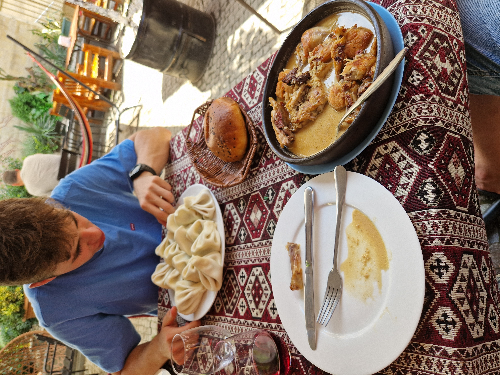
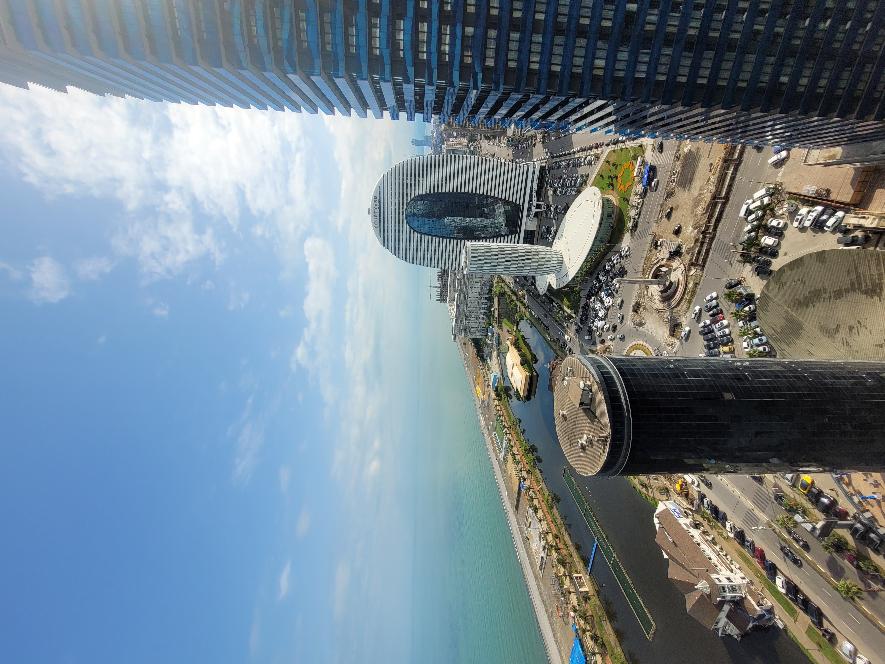
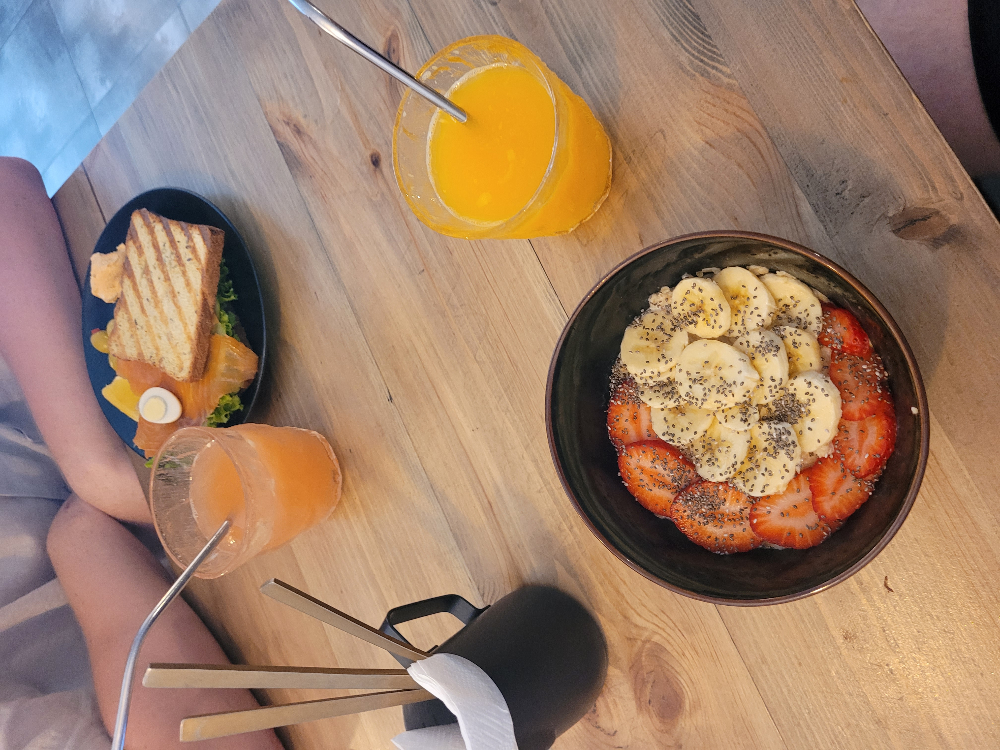
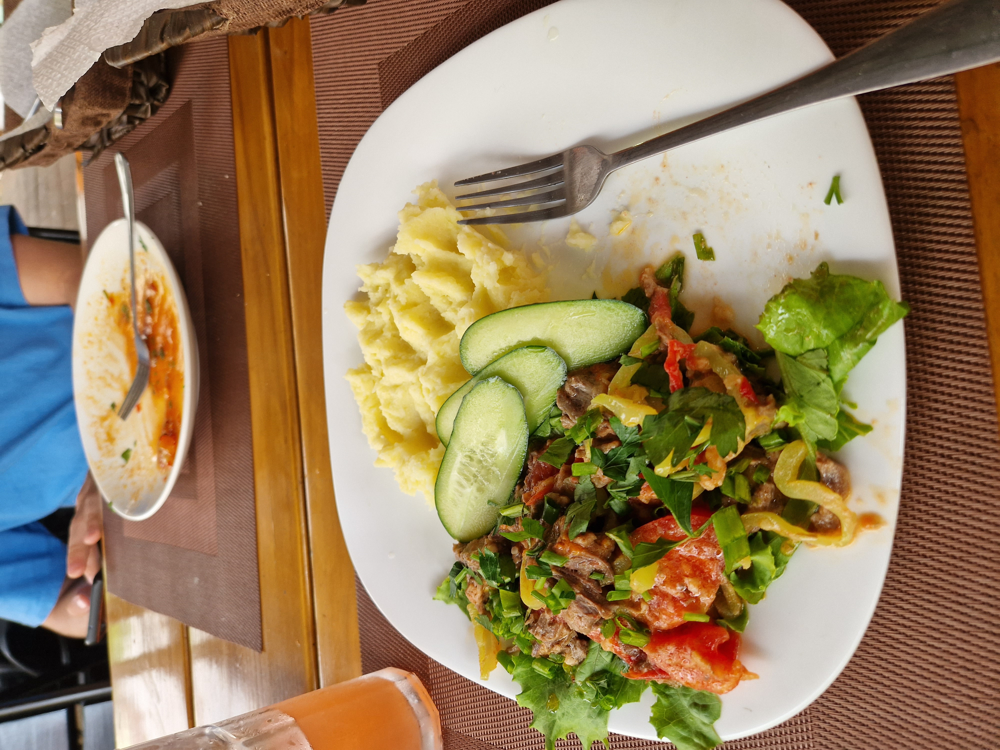
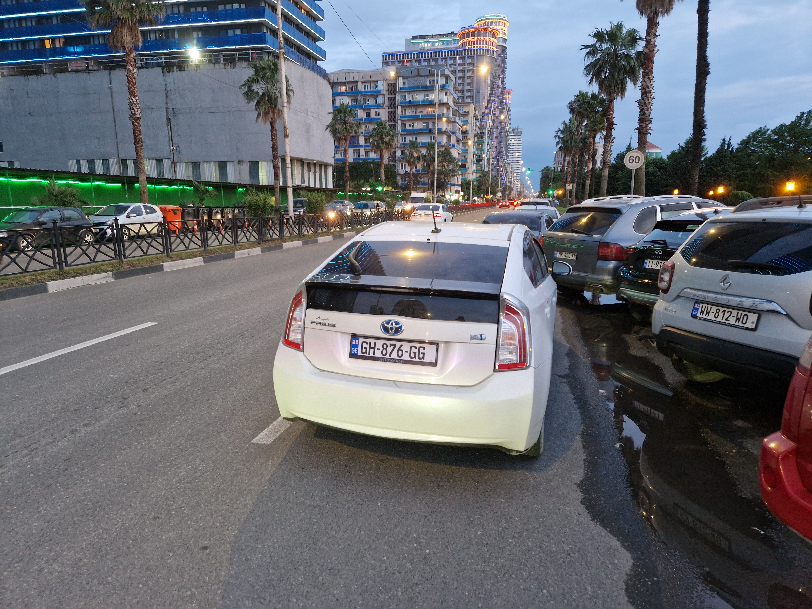
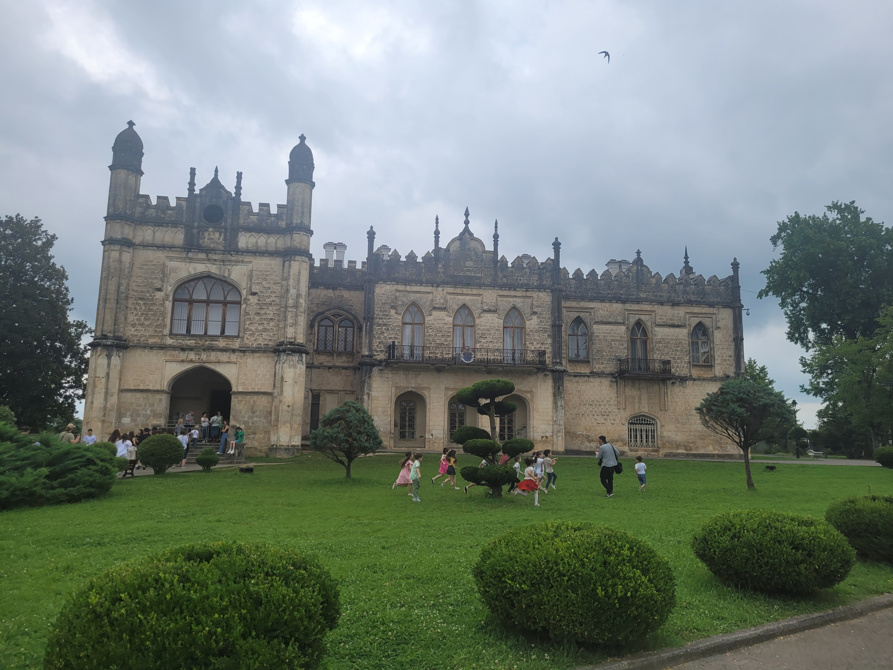
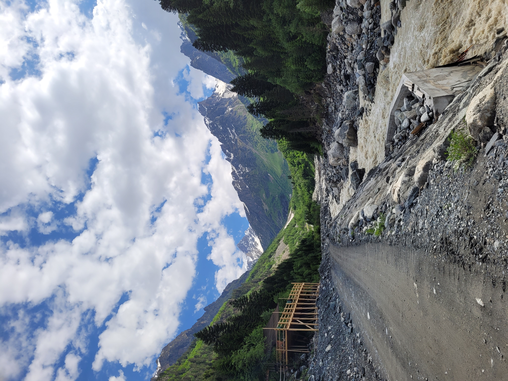
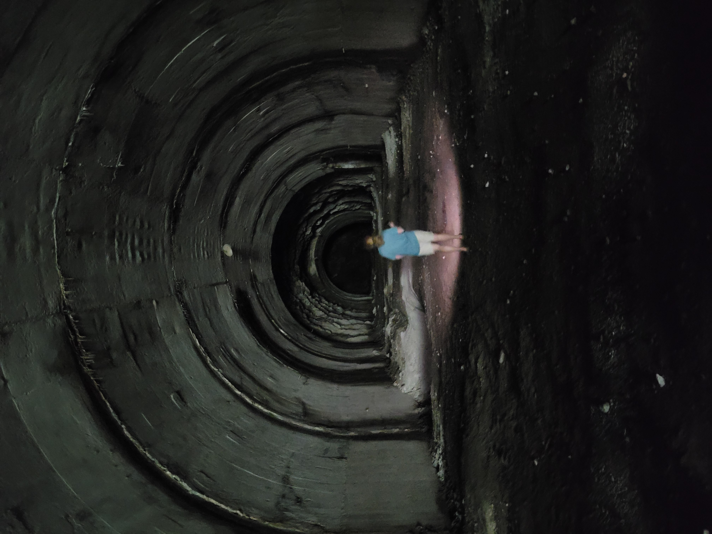
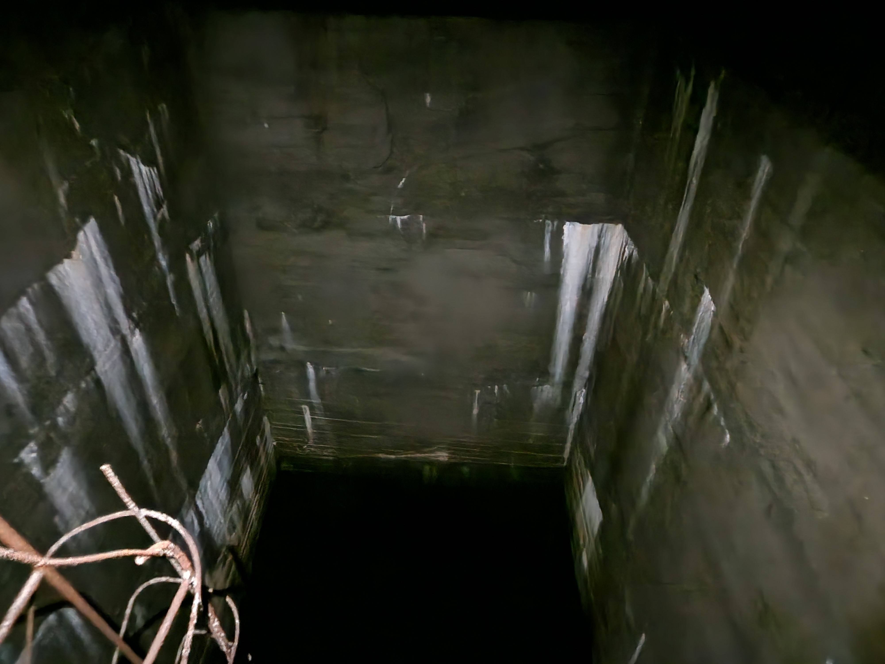
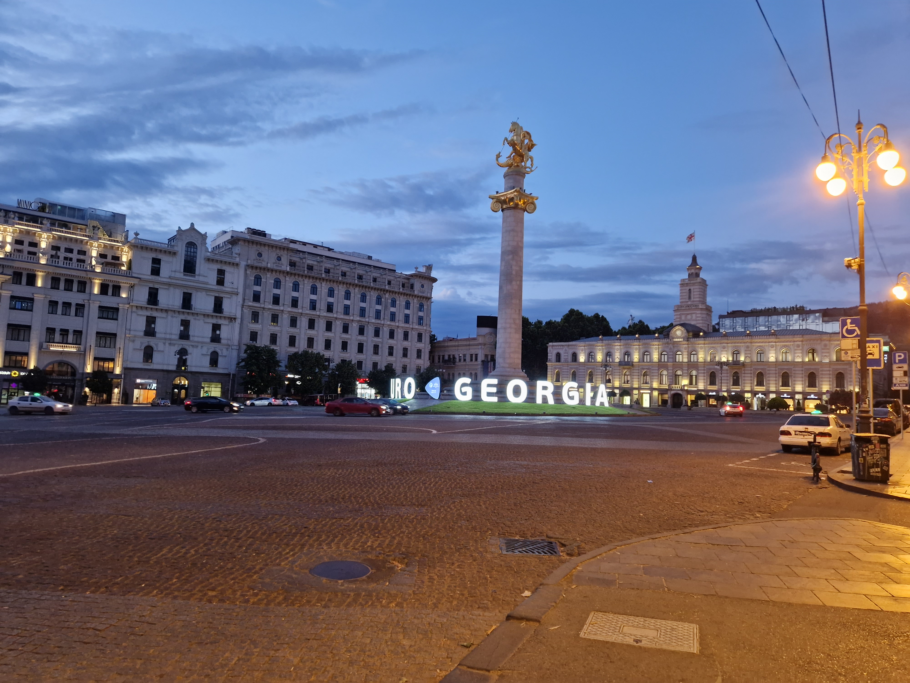

Na přelomu června a července jsem spolu s mým bratrancem navštívil matičku vína - gruzii. Celé jsme to upekli opravdu na rychle, protože letenky jsme si koupili ve čtvrtek a v neděli jsem už vyráželi.  

## Cesta:
Vyráželi jsme kolem 3 ráno z Frýdku-Místku směr Katowice. Na letiště jsem měli odvoz, protože podle našeho googleni neexistuje žádný rozumný způsob jak se tam dostat v požadování čas. Na letišti jsem byli s 2 hodinovým předstihem. Poprvé se mi stalo, že by tady opravdu důsledně kontrolovali velikost kufrů a batohů. Něktří lidí především gruzinci to nesli opravdu nelibě a tvrdošině odmítali zaplatit. Proto batohu vyloženě dokopali do požadované klece. Po příletu jsem pouze vystáli frontu na kontrolů pasů, kde se paní podívala na fotku a dostal jsem razítko a vyšel jsem z Letitě Kutaisi.

## Den první
První den se nesl v dobré náladě. Po počátečním náročném přesunu do Gruzie jsme se přesunuli do  města Kutaisi. Kde jsme chtěli zahají den obědem. Jenže už při pokusu vzít si autobus z letiště do centra města jsme narazily. Ne, že by bylo nebyli možnosti ale moc se nám nezamlouvali ceny. Nejlepší nabídka činila 35 Lari, což se nám zdalo jako příliš mnoho. Nenapadlo nás se však podívat se jak je to vlastně daleko je od letiště. Po vyjednávání jsme to usmlouvali na 30, což nám stle přišli drahé, ale už jsme na letitě byli hrozně dlouho. Přijel pro nás autem co byla starší my. Dohromady. A velmi pravděpodobně i on. Pás se nedal zapnout a tachometr rychlost neukazoval ale pouze odhadoval.

Konverzace s řidičem byla náročná a tak něják jsme tušili, že to tak bude všude. Rozhodli jsme se opatřit si SIM kartu . Pan taxikář nás vyhodil na "Autobusovém stadionu", což byl mcdonald kolem kterého bylo parkoviště, které sloužilo jako autobusová zastávka. Jako prvo řadé se nám jevilo sehnat si simkartu. Vyrazili jsme na lov. Zde se ukázalo, že domluva bude náročná. Jedna paní sice rozuměla co poní chci ale odpovědět už bylo nad její schopnosti. Ptali jsme se 3 Gruzínců, kteří nás poslali obchodu kde paní měla vyprodáno. Děsivé na této ulici bylo že zde leželo spousta psů na kraji silnice a vypadali "hodně" mrtvě. Napadalo mě jediné - a to že je někdo přejel a hodil na kraj. Ukázalo se že psi ležící nehybně na ulici jsou zde normální. Po zajímavém rozhovoru s mladou dvojící Gruzínek jsme  byli poslání na autobus do "reálného" centra. Měli jsme jet autobusem 20 nebo 1. Platit mělo prý jít kartou a nakonec šlo. 

Autobusy vypadli  jako ty malé z Brna. A musím říct, že pan řidič byl nejspíš na stáží v brně. V autobusu jsme se domluvili že půjdeme do info centra, které mělo být "někde tam kam jedeme". Náhoda nám přála takže jsme vystoupili doslova naproti něj. Vešli jsme tam a jedinou věc co jsem řekli tak byla "SIM card", což mi pak došlo jak to muselo znít. Nevadí.

Po úspěšném lovu na sim kartu, jsme šli na jídlo. Bratranec si dal místní specialitu. Popsal bych to jako "Knedlíčky". Já jsem měl polévku s kuřecími kousky. Polévka byla hnusná. Maso v polévce bylo hodně dobré. Hodně česnekové. Ale knedlíčky. knedlíčky. Ty byli MEGA. Lukáš se ptal paní kolik knedlíčků si má dát, paní mu řekla 10-15. Dal si 15. Na fotografii můžete vidět, že 15 je opravdu hodně. Nakonec jsme z toho měli i večeři.

Celé to stále na koruny asi 800 spolu s pitím. Na gruzii drahé. Bylo to ale krásná restaurace s anglicky mluvící obsluhou.

Po obědě jsme šli na `bilý most` a tak obecně se projít po centru. Most byl relativně hezký ale jako takové se na něm nedá moc vidět. Místní řeka je hodně kalná. Prý je to způsobeno vápencovým podložím. Centruom města stojí za procházku, ale nic spektakulárního tady není. 

Kolem druhé jsme se vydali do kopce na kterém se nachází `kategrálu bagradi` .Tato katedrála byla krásná a mejestátní. Může vylést na blízkou zed a udělat si panoramatickou fotku s městem. Zde jsme se dali do řeči s vojákem, který nás ujistil, že nejspíš není co dalšího vidět v kutaisi. Proto jsem změnili naše původní plány vyrazili směr Batumi. Nejdříve na parkoviště u McDonaldu, a potom maršutkou. 

Maršutka je gruzický typ autobusu který vyjíždí až když se naplní nebo až když se řiči chce. Jsou to spíš dodávky s asi 15 místy. Těmi to autobusy se dá cestovat napříč gruzii velice levně. Obvykle se dá smlouvat. My jsme nevěděli že se dá smlouvat takže nás to stálo 20 Lari na osobu.

Cesta trvala asi 3 hodiny, přičemž pocestě jsme si vybríli ubytování. Na konec jsme se rozhodli "za investovat" a vybrali jsme si jedno z dražších ubytování za něco méně než 1400 korun na noc pro dvě osoby. Ubytování jsme měli přes airbnb. 

Město Batumi má značně modernější "look" a přijeho procházení máte  spíše pocit  moderního velkoměsta. Nachází se zde mimo-jiné letiště a je to oblíbené letovisko. Nachází hned vedle moře, pláž je oblásková. V centru města je i lanovka. Na kopec. Ve městě se nachází spousta kasín což je podle místních způsobeno tím že spousta turků zde jezdí gamblit, protože je to regulováné.

Ubytování jsme měli hned vedle moře, stačilo přejít přechod přes hlavnější cestu. a člověk byl hned u pláže.

## Den druhý
Druhý den jsme rozhodli že vyzkoušíme kolik zde stojí zajít si na snídani. Proto jsme si našli jeden podnik v okolí který jsme infiltrovali. Ceny snídaně byli stejné jako u nás. Dali jsme si lososový sandwith a ovesnou kaši.

Předem jsme měli vymyšlené co budeme dělat. Dnes byl na programu botanický park v blízkosti města. Rozhodli jsme se že dojedeme ke vchodu více vzdáleném od města, Boltem. řidič uměl asi tak slovo anglicky. Doslova. Umění google předkladače ale funguje vždy.

Botanický byl krásný a rozhodně bych doporučil abych se zde zastavit. Projít celý park není v lidských možnstí za jeden den. Vstup je placený. V parku taky najdete lanovku kterou si můžete zaplatit za v přepočtu asi 25€ na osobu a za ten výhled to učitě stojí. 



V potanickém parku jsme byli skoro celý dopoledne i odpoledne. Prošli jsme jej na příč z jednoho vchodu do druhého. Odtud, ale i sem se lze jednoduše dostat autobusem (google mapy pomůžou) zpět do Batumi. 

Po cestě jsme potkali jednoho gruzince který uměl perfektně anglicky a povídali jsme si celou cestu autobusem. Chtěl nám ukázat jeden podnik kde nám chtěl doporučit něco na jídlo ale bohužel byl zavřený. Nakonec jsme skončili v [ruské restauraci](https://www.google.com/maps/place/SMILE+OF+THE+PAST/@41.6456259,41.6270531,82m/data=!3m1!1e3!4m12!1m5!3m4!2zNDHCsDM4JzQ0LjgiTiA0McKwMzcnMzguMCJF!8m2!3d41.6457751!4d41.6272073!3m5!1s0x406787c67e9d2717:0x66aaceeefb1ade45!8m2!3d41.6457207!4d41.6271015!16s%2Fg%2F11rvdbtq0b?entry=ttu) v cetru města. Jídlo s pitím stálo méně jak 500 korun.

Potom jsme organizovali už jen pujčení auta a koupaní v moři. Večer jsme se ještě sprasili burgerem z jednoho plážového stránku, který byl dost dobrý, ale relativně drahý. 

## Den třetí

Jak jsem psal výše, rozhodli jsme se pujčit auto a vyrazi do města Mestia autem. Auto jsme si pujčili přes whatsapp-ové číslo. Auto nám přivezli k ubytování. Záloha byla 100€/$ s cenou 65 lari za den. Kvůli mého nízkého věku mi nebylo dovoleno zapujčit si pickup ford ale pouze tyotu pryus. Na vypujčku by jsme asi nepřistoupili nebýt ujištění majitele:

> Pokud pojedete jen do mestie, tak to nepořebujete

Nevím jestli se to ztratilo v překladu nebo co ale ukázalo se že to je hodně odvážné prohlášení. Auto bylo asi 5 let staré a pravděpodobně importované z Ameriky, protože některé udaje byli v milích a farhantech TODO. Autu svitíla kontrolka(jak jsme později zjistil) brzdových destiček. Pán který nám auto přivezl uměl jen rusky a přivezl sebou svou dceru, která něco málo uměla. Domluvili jsme se v pohodě. Auto byl hybrid.

Vyrazili jsme na sever. Cesta ubíhala rychle a rozhodli jsme se zastavit v městě Zugdidi, kde se nachází krásný "hrado zámek", který stojí za prohlídku. My jsme si jej prohlédli jen z venčí protože tam zrovna byla školní exkurze. Město jsem si prošli jen tak zběžně, protože jsme hlavně chtěli jíst. Nepodařilo se nám najít nic co by vypdalao zajímavě takže jsme skončili v nějém asijské restauraci, ve které jsme si dali jídlo které bylo skromně řečeno hnusné.

Po nevydařeném obědu jsme pokračovali v cestě. Čím jsme se blížíli našemu cílu tím víc *malebnému* výhledu jsme se vystavovali. Výjezd z nuly do 1500 metrů patří k té nejhezčí cestě autem co jsem absolvoval. Z počátku jsme jeli udolím, jedním hezčím, jak druhým. Ale začal se projevovat i rozmanitost mistních silnic - což si představte jako kdyby silnice občas zmizela a oběvila se až za pár kilometrů. Díry v cestě jsou ten nejmenší problém. Dalším problémem je, že občas jsme potkali krávu které docela často seděli právě uprostřed cesty. Brzy jsem pochopil že kdybych se měl držet svého jizního pruhu tak bych byl na cestě ještě ted. V gruzii jsme měl pocit, že jidzní pruhy v podstatě neexistují.

Čím víc jsem byli, tím víc bylo méně cesty. Ale s opatrností se v pohodě dalo opravdu v pohodě jet. Kdy jsem dojeli do Mestie, chtěli jsme si spravit chut a vydali jsme se do stánku s kebabem :), který byl vpohodě. Bylo už dosti večer proto jsme si už jen koupili snidani a šli spinkat.

## Den čtyři

Byli jsme v krásných horách, kde by byl hřích nezají se aspoň projít. Ale jak čas tak vybavení bylo proti nám. Moje cestovatelská obuv jsou cukle. Jsou pohldné a ušetřím místo v batohu na ponožky. Leč je tato obuv geniální tak není vhodné pro chození v horách. Nakonec jsme si nechali poradit jednoduchou procházku k ledovci. A byl to skvělý nápad. Protože ty výhledy. Ty výhledy...

Při cestě do Batumi jsem se rozhodli navštívat jednu z krás o které jsme se dozvěděli náhodou. Před rozpadem sovětského statu zde sověti začali se stavbou MEGA přehrady pro jejiž stavbu zde postavili síť tunelům. Průzkům těchto tunelů patří k tomu nejlepší co jsem v gruzii vidět. Dokonce pokud to chcete tak můžete i potápět v hlubokých jeskyních. Nejde to moc popsat slovy ale připojím pár fotografií.

Pak nás už jen čekala nudná cesta zpátka do batumi, kde jsme akorát vrátili auto. Tentokrát naše ubytování byli méně okázalé a bylo dále od moře. Pořád ale bylo krásné pod 600 na noc za dva lidi. 
 
## Den pět
Nejzajímavější části naše výletu byl vnitrostátní let z batumi do Thibilis, který jsme měli absolvovat právě dnes. S mirnou nervozitou jsem vyrazili na letiště v Batumi. Tento let nám měl ušetřit spoustu času protože jinak by jsme museli jet vlakem, který nejezdí moc často nebo maršutkou která jede docela pomalu, protože furt zastavuje. Na letitšti si zajdete k odbavení pro letenku kde vám jej vypíšou propiskou a pak už jen čekáte na bezpečností kontrolu a hůrá do letadla.

Letadlo je malinkaté asi pro 12 lidí. Pravděpodobně poletíte tak že uvidíte města Batumi od moře. Krásný pohled a za dvě hodiny přiletíte do letiště v blízkosti Thibilis což je asi tak 40 minut od centra. Airolinka zajistí aji odvoz do centra. Trvá to těch 40 minut a je to. Jste v hlavní městě.

Bohužel nám už to odpoledne došla energie. Po předchozích nabitých dnech to bylo vykoupeno tímto méně akčním. Jedině co jsme stihli tak bylo zajít s původen ruským pilotem, kterého jsme potkali při letu na oběd a najít si ubytování.

Pan pilot byl fajn a hodně jsme toho spolu nakecali. Ptal jsem se ho i na to jaké to je žít v rusku na což mi řekl jen, že tam více jak 7 let nebyl. 

## Den šest
Thibilis je obrovské města které má více jak milion obyvatele. Určitě to tady je je dražší jak kdekoliv jinde kde jsme předtím v gruzii byli ale není to nikterak strašné. Nicméně zde jsme měli nejlevnější ubytování vůbec což bylo za 315 korun za noc pro dvě osoby. Ubytování bylo vedle hlavní silnice ale bylo čisté. S kuchyní a dokonce pračkou. 

V tento den jsme se rozhodli že vyjedeme jednou z lanovek na vrchol na kterém se nachází zřícenina hradu. Ten jsme se prošli pokochali a nakonec jsme šli pěšky dolů do města aby jsem došli k "zubatce" a vyjeli znovu na jiný kopec do zábavního parku. V zabavním parku Mtatsminda Park jsme nakonec šli na ruské kolo ze kterého byli krásné vyhledy. Jediné co nás mrzí že se nejde dostat na televizní věž která je taky na tomto kopci. 

Večeře
## Den sedm
Za koupili jsme si autobus pro dopravu na letiště kutaisi. Stále 25 lari. Autobus je vázený na konrétní let a odjiždí tak aby jste to v pohodě stihli. Takže jsem vstanuli v 4:40, jeli ubrem na zastaváku a je to tady. Poslední fotka kterou jsou pořídil v gruzii.

Pak nás už jen čekala dvouhodinový cesta na letiště. A samotné let. Dost jsem spal. a nestalo se nic zajímavého.

Zajímavé věci se děly až v katowicích kdy musíte projít kontrolou přichodu do shengenského prostor což bylo možná i poprvé co jsem to absolvoval. Ale žádné drama se nekonalo. Problé byl až když jsme zjistili že autobus do centra katowic nejde zaplatit kartou takže jsme jeli na černo :). No nic. Pak už jen flix bus do ostravy a autobus který jsem kdysi dávno jezdil z ostravy z kina přímo domů. A konec. 

# Závěr:
Děkuju pokud jste dočetli až sem. Pokud jsme vám pomohlo jsem opravdu rád. Na závěr pár rad:

# Rady:

## Letenky

### čr - gruzie:
Nejlevněji z poslka. Dá se sehnat i let do thibilis ale bývá drahý.
### Vnitrostátní lety
Provozuje je jedna letecká společnost. Bývajá dost plné - takže rezervovat předem a často se ruší protože musí být "dokonale počasí". Rychlý přesun + zažitek. Doletět se dá i do Mestie (mega uspora času) 

## Doprava po gruzii
- Maršutka
    - levné, uspokojivě ryché, levné i když cestujete sami. Ale je to MHD
- Autobus
    - krom autbousu na letiště není moc možností aspoň co vím
- Vlak
    - existuje i noční. víc nevím.
- vnitrostatní lety [tady](#vnitrostátní-lety)    
- pujčení auta
    - více lidí je výhoda 
    - na internetu, nebo vygooglit whatsup čislo které poskytuje auta taky. Ale podepisujete něco co je napsané rusky/gruzinsky, těžko říct kdyby byl nějáký pruser co se stane. Naše půjčka byla ale vytvořená po známosti takže možná ojedinělý případ.

## řízení
Gruzinci řídí jako hovada. Nerespektují dopraví pruhy, rychlost, zákazy předjiždení a pod. bež se vytvařejí nové pruhy pro předjižední. Běžně vás předjede autobus. Zážitek ale někde má člověk pocit že to už je moc. Gruzinec mi řekl že evropané jezdí připosraně. Taky mi řekl že pokud gruzinec neřidí auto předtím než je mu 14 tak není opravdový chlap. Troubení je taky častější jak u nás.

## Jazyky:
### Ruština:
Rusky umím minimálně. Většina gruzinců tvrdí že umí rusky. Pravda z mojí zkušenosti je taková že oni rozumí rusky ale mluvit neumí. Takže asi jak já. Promluvit gruzinci rusky jsem neslyšel ani jednou. Je tady ale hodně rusů
### Angiština
4 z 10. U mladých asi 5 z 10. Staří vůbec. Střední generace někdy překvapí.

## Rusové
Je jich tady hodně. Gruzinci rusy podle všeho nemají rádi. Nemyslím si že by to bylo kvůli války.

## Bezpečnost:
Všechno v pohodě. Není se čeho bát v podstatě. Jen to řízení. Ale raději bych nenechával cenné věci v autě.

## Psi
Celá gruzie je plná psů. Potkáte je i ná tůře. Nejsou nebezpeční ale vyhnul bych se jim raději. Nikdy nevíte co můžou mít za nemoci.

Pokud máte další otázky napište mi na [mail](mailto:kuba24862vlk@gmail.com)

