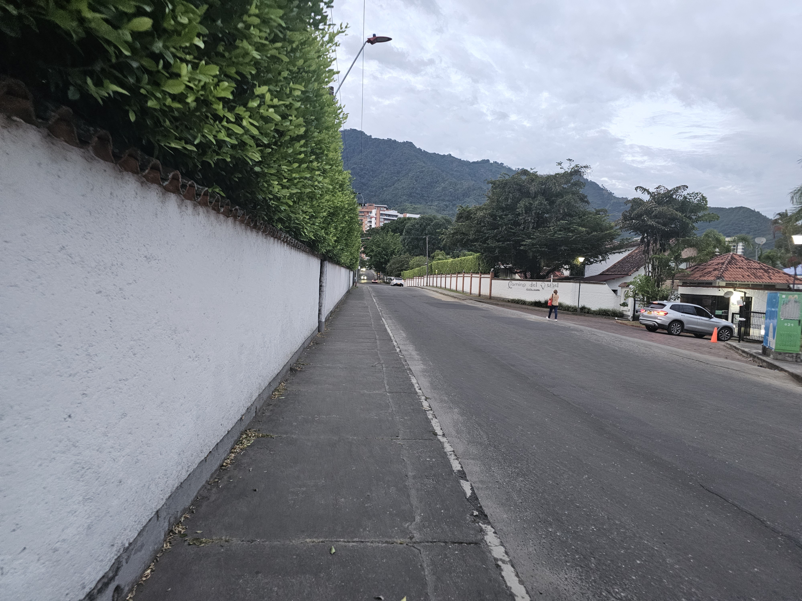
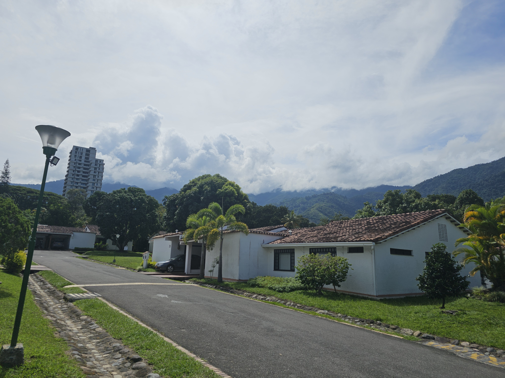
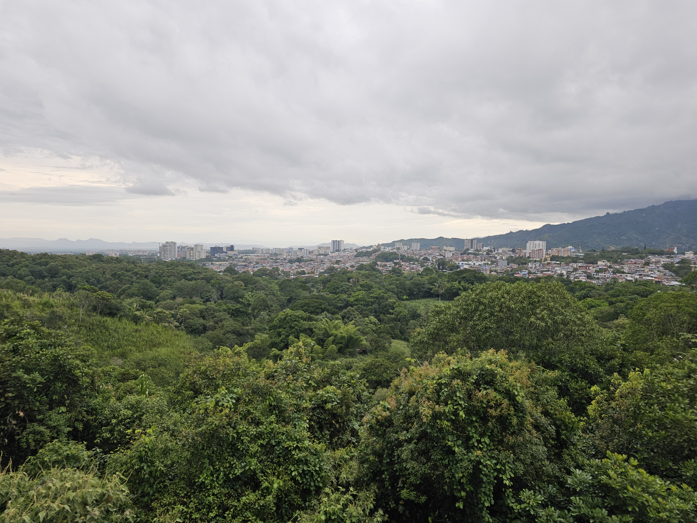

Přes prázdniny roku 2024 jsem měl možnost se podívat na 3 měsíce do Kolumbie jakožto stážista.
Už delší dobou jsem si pohrával s myšlenkou, že bych mohl zkusit vyjet na stáž někde do zahraniční. Původně jsme chtěl jet na stáž někde do asie. To se mi však nepovedlo. Nakonec se mi povedlo dostat na stáž do kolumbie. Tento text popisuje moje zkušenosti z této stáže. Stáž byla získání přes organizaci iaste. 

<!--more-->

Vzhledem k tomu že by asi nebylo mco zábavné si číst den/týden po týdnu co jsem dělal rozhodl jsem se tento článek pojmout jinak a to sice tak abych dokázal předat jak zkušenosti ze stáže tak zkušenosti z Kolumbie jako země. Tedy článek bude rozdělen podle nadpisů a můžete si přečíst jen část co vás zajímá. 

## První dny a příjezd

Na začátek tedy poruším to co jsem předchvíli napsal

Letěl jsem krásných 17 hodin rozležených do 3 letů. První přelet byl jen krátký z Vídně do frankfurtu. Let byl uplně plný a o to víc zvláštní bylo že se mi povedlo získat exit row. Druhý let byl 12 hodinový let Frankfurt-Bogota a poslední let byl vnitrostátní Bogota-Cali. Všechny lety byli vpohodě. Trochu jsem se bál německého jídla ale nakonec všechny jídla byla moc dobrá. 

V době kdy jsem letěl zrovna vrcholilo fotbalové euro a k tomu začínala sezona dovelených. Není překvapující, že všechny lety byli zpožděné. 

V letadle A340-600 jsem seděl uprostřed. Ale oba spolusedící byli v pohodě lidi. A 12 hodin docela uteklo rychle akorát si musím postěžovat, že rychlost nabíjení ze zdějšího USB byla fakt pomalá. Telefon mi ukazoval 11 hodin do plného nabítí. 

Na letišti jsme přistály kolem 18 večer místého času. Omyl jsem se se něják dostal na termínl pro mezinárodní lety a stálo mě hodně nervů než se mi povedlo se dostat zpátky do vnitrostátního. Měl jsem štěstí. Poslední let jsem celý prospal. Nakonec jsem přistál v cali něco málo po 22 hodině. Domácího času to vycházelo na 3 rání. Sedl jsem si před termínal a koupil si už jen hotel. Objedla jsem si taxík, dojel do hotelu kde jsem prakticky hned usnul. 

Druhý den jsem se vzbudil před 6 ráno. Chvíli jsme zevloval a pak jsem vyrazil na univezitu. A zjistil jsem hodně nepříjemné věci.

Abych to zkrátil tak jsem zjistil, že moje stáže má začít až v srpnu. A nedá se s tím nic udělat. Naštěstí jsem se spojil s paní s kolumbijské strany a vypadá v tento moment to vypadá že bych mohl mít stáž jinde. Bohužel mi nic nemohla slíbit a tak mi nabídla abych se jel za ní do města kde ona bydlí. Podávala to zak že bych u ní mohl bydlet. Myslel jsem si že to je chyba v překladu.

V tento moment jsem byl skoro rozhodnutý, že ji řeknu že ne a poletím zpátky protože jsem měl pocit že se na mě opravdu lepí špína a cestovat přes půl kolumbie pomocí autobusu, když neumíte ani slovo španělsky asi není ten nejlepší nápad. Ale nakonec jsem uspěšně dojel do správného města. Kde se stalo přesně co čemu jsem rozumněl.

Tato paní mi otevřela svůj byt a ukázala kde je pokoj kde je koupelna a šla do města kalit. Nechápal jsem co se děje, ale protože to vycházelo na 4 ranní českého času a ještě kvůli jetlagu jsem skoro nespal tak jsem jen usnul. Druhý den ráno než jsem otevřel oči tak jsme si byl skoro jistý že se probudím v pokojíčku u sebe doma.
Nestalo se tak. Vzbudil jsem se v šílených 5 rano a společnost mi dělal její manžel a jejich pes. A ukázalo se, že to jsou moc milí lidi. Navázal jsem s nimi přátelství a jejich psem jsem si padl hned do oka. 

Díky této paní jsem poznal spoustu jejich přátel a dokonce jsem šel s ní na karneval v Ibague. Který patřil k nejlepším zážitkům které jsem v Ibague zažil. Mimo tohle všechno mi i našla novou stáž přímo zde. Kdybych měl vyjmenovat co všechno pro mě udělala tak by jsem tady byli dlouho prostě jde o to, že díky ní se zmojí stáže nestala uplná katastrofa a pomalu jsme si to začal užívat. 

# Internship 
Becouse my internship was kind of unexpected and recent no one was expecting me. Unfortunatly there was summer break for the whole university so there was almost no students in the campus. But fortnunetly the bos of infrmatical deparment havent go for vacation so he was okay with becoming my superviser and joing his team. 

## My job

My supervisor gives me some random job about rewriting some plugin in java and extending this code with some functionality. At the start it was quite challenging but later it sordouts it is very simple and it takes me only a few days to finished. After that my supervisor asked me if i can study new type of neural network architecture -- KAN. My whole previouse studies i was skipping the neural networks stuff so i was not really happy about it but had said that i will try my best. After some time it turns out that this topic is very interesting. I was reading a lot of papers about realtic topic and was learning something new. It helps me a lot with understanding another topic that i have skipped during my bc. studies. I was mainly focusing on clasification of the pictures.

So mainly i was reading some papers and try to reproduce some results on data that my collegues had use by to train clasic architectures. I was comparing the results with theirs. I was doing model for classification of brain tummors. After understanding of basic math principles i was trying to use this layer's for improving classification model that they've used for indetify brain tumors. 

Another big part of my job was something like tech support fot whole it deparment. So setting up linux, helping with the ssh, libraries and sysadmin topic. And programing. I was doing helping other students with the programing. 

## English
The hardest part of the intership was that no one accept my superviser speak at reasonable level of english. That was kind unpleasant suprise becouse all the member of the group around my supervised will become or already become ingenirs at informatic. So i would expect quite good know ledge of english. But it gives me motivation for leaning spanish but if i want to speak with my collegues i have to learn some spanish and this helps me a lot with surviving outside of the university.

So students ussually have no idea about english at all. Even at the lowest level. Teachers as well.

## Working hours

Generally speaking in columbia people ussually starts at 8 works till 12 and them go somewhere for lunch. Ofently to home to cook something and mayby taky and nap. Or you can go to some restaurant for lunch as well. After that theyll return fot resuming the work at 14. For me it was stange but after some time it was okay.

## Accomodation:
I was living at the house about 20 minutes by slow walk from the campus. My host family was one gradma that hasnt speak at all at english. She was verry nice to me and including my accomotaion was everyfood that i can eat. My host was more or less like my grandma completly. She was always warried if i'm already full or if i need more food. I had my own floor with room, bath room and even private balcony. I had great time there.

The location if the accomodation was as i find out latly at one of the most expesive neigberhood in Ibageue. There's a gate with the gate keeper and you have to have acces to this area.

## Event for the interns 

During my internship at the University of Ibagué, I had the opportunity to meet several other interns from Europe. There was one from Romania, two girls from Spain, and two from the Czech Republic, along with many exchange students from Mexico, and one more intern from Chile.

The university has a group dedicated to staying in touch with international students, and they organize events for us throughout the year. They have a large WhatsApp group, and they usually send invitations to these events via message.

I don’t need to go into too much detail, but I just want to give a quick overview for anyone planning to visit the university, so you’ll know what to expect.

### Events and Activities

I was invited to an event where we had dinner and watched football at the house of one of the girls in charge of the international student group. She invited me along with three other Colombians. Everyone was very friendly, and the evening was a great experience.

Other events organized by this group included:

- Visiting the cinema
- Bowling
- Coffee at a traditional coffee shop
- Watching football matches
- Club parties
- Several group dinners

All of these events were a lot of fun and provided great opportunities to bond with others.

Additionally, there was an event where we visited the Tolima Regional Museum, and a trip to the nearby lake. You can read more about that in the [Trips Section](#Lake-and-Smth).

## International friends and local friends

I had the chance to get to know the girl from Romania, and we became friends. Most of the trips mentioned in the later section were completed with her. Another good friend I made was the Czech guy.

I'm still in touch with some coworkers from the office, as well as with the Colombian family I stayed with during my time there.

# Ibague

# Trips:

During my internship in Colombia, I had the opportunity to take several memorable trips, which I’d like to share here.Since I usually worked from Monday to Friday, my travel time was limited, which meant I often had to plan short weekend trips. As a result, I often planned trips that fit into my weekends. Occasionally, I would take a day or two off from work to extend my trips. These short trips allowed me to explore Colombia’s rich culture and stunning landscapes, from vibrant cities to breathtaking natural parks.

## Bogota

## Meledin

## Salento

## Lake and smth

## Roundtrip mountine trip to Manizales



## Cartagena and Santa Marta

~~ The education was really focus on ML and that was strange becouse they havent been realy good programers. That was strange as well. ~~

 

