During the summer of 2024, I had the opportunity to go to Colombia for 3 months as an intern.
For some time, I had been toying with the idea of trying to go on an internship somewhere abroad. Originally, I wanted to go on an internship somewhere in Asia. However, I didn't succeed in that. In the end, I managed to get an internship in Colombia. This text describes my experiences from this internship. The internship was obtained through the IAESTE organization.

<!--more-->

Given that it probably wouldn't be much fun to read a day-by-day/week-by-week account of what I did, I've decided to approach this article differently, namely to convey both the experiences from my internship and the experiences of Colombia as a country. Therefore, the article will be divided into headings, and you can read only the parts that interest you.

## First Days and Arrival

To start, I'll break what I just wrote.

I flew for a beautiful 17 hours, spread across 3 flights. The first flight was just a short hop from Vienna to Frankfurt. The flight was completely full, which made it all the more remarkable that I managed to get an exit row. The second flight was a 12-hour flight Frankfurt-Bogota, and the last flight was domestic, Bogota-Cali. All the flights were fine. I was a little worried about German food, but in the end, all the meals were very good.

At the time I flew, the European football championship was in full swing, and the vacation season was starting. It's not surprising that all the flights were delayed.

On the A340-600 plane, I was sitting in the middle. But both of my seatmates were nice people. And the 12 hours passed quite quickly; I just have to complain that the charging speed from the USB here was really slow. My phone was showing 11 hours to full charge.

We landed at the airport around 6 pm local time. Somehow, I mistakenly ended up in the international flights terminal, and it took a lot of nerves before I managed to get back to the domestic one. I was lucky. I slept through the last flight. Finally, I landed in Cali a little after 10 pm. According to home time, that was 3 in the morning. I sat down in front of the terminal and just booked a hotel. I ordered a taxi, got to the hotel, and practically fell asleep immediately.

The next day, I woke up before 6 in the morning. I lazed around for a while, and then I headed to the university. And I found out some very unpleasant things.

To put it shortly, I found out that my internship wasn't supposed to start until August. And there was nothing to be done about it. Fortunately, I connected with a lady from the Colombian side, and at this moment, it looks like I might be able to have an internship elsewhere. Unfortunately, she couldn't promise me anything and offered to go to the city where she lives to see her. She suggested it as if I could live with her. I thought it was a translation error.

At this point, I was almost decided to say no and fly back because I felt like I was getting scammed, and traveling across half of Colombia by bus when you don't know a word of Spanish probably isn't the best idea. But in the end, I successfully made it to the right city. Where exactly what I understood happened.

This lady opened her apartment to me and showed me where the room was, where the bathroom was, and went to the city to party. I didn't understand what was happening, but because it was 4 am Czech time and also because of jet lag, I barely slept, so I just fell asleep. The next morning, before I opened my eyes, I was almost certain that I would wake up in my bedroom at home.
It didn't happen. I woke up at a crazy 5 in the morning, and I was accompanied by her husband and their dog. And it turned out that they are very nice people. I made friends with them, and I immediately clicked with their dog.

Thanks to this lady, I met many of her friends, and I even went to the carnival in Ibague with her. Which was one of the best experiences I had in Ibague. Besides all this, she even found me a new internship right here. If I had to list everything she did for me, we would be here for a long time; the point is that thanks to her, my internship didn't turn into a complete disaster, and I slowly started to enjoy it.

# Internship 
Becouse my internship was kind of unexpected and recent no one was expecting me. Unfortunatly there was summer break for the whole university so there was almost no students in the campus. But fortnunetly the bos of infrmatical deparment havent go for vacation so he was okay with becoming my superviser and joing his team. 

## My job

My supervisor gives me some random job about rewriting some plugin in java and extending this code with some functionality. At the start it was quite challenging but later it sordouts it is very simple and it takes me only a few days to finished. After that my supervisor asked me if i can study new type of neural network architecture -- KAN. My whole previouse studies i was skipping the neural networks stuff so i was not really happy about it but had said that i will try my best. After some time it turns out that this topic is very interesting. I was reading a lot of papers about realtic topic and was learning something new. It helps me a lot with understanding another topic that i have skipped during my bc. studies. I was mainly focusing on clasification of the pictures.

So mainly i was reading some papers and try to reproduce some results on data that my collegues had use by to train clasic architectures. I was comparing the results with theirs. I was doing model for classification of brain tummors. After understanding of basic math principles i was trying to use this layer's for improving classification model that they've used for indetify brain tumors. 

Another big part of my job was something like tech support fot whole it deparment. So setting up linux, helping with the ssh, libraries and sysadmin topic. And programing. I was doing helping other students with the programing. 

## English
The hardest part of the intership was that no one accept my superviser speak at reasonable level of english. That was kind unpleasant suprise becouse all the member of the group around my supervised will become or already become ingenirs at informatic. So i would expect quite good know ledge of english. But it gives me motivation for leaning spanish but if i want to speak with my collegues i have to learn some spanish and this helps me a lot with surviving outside of the university.

So students ussually have no idea about english at all. Even at the lowest level. Teachers as well.

## Working hours

Generally speaking in columbia people ussually starts at 8 works till 12 and them go somewhere for lunch. Ofently to home to cook something and mayby taky and nap. Or you can go to some restaurant for lunch as well. After that theyll return fot resuming the work at 14. For me it was stange but after some time it was okay.

## Accomodation:
I was living at the house about 20 minutes by slow walk from the campus. My host family was one gradma that hasnt speak at all at english. She was verry nice to me and including my accomotaion was everyfood that i can eat. My host was more or less like my grandma completly. She was always warried if i'm already full or if i need more food. I had my own floor with room, bath room and even private balcony. I had great time there.

The location if the accomodation was as i find out latly at one of the most expesive neigberhood in Ibageue. There's a gate with the gate keeper and you have to have acces to this area.

## Event for the interns 

During my internship at the University of Ibagué, I had the opportunity to meet several other interns from Europe. There was one from Romania, two girls from Spain, and two from the Czech Republic, along with many exchange students from Mexico, and one more intern from Chile.

The university has a group dedicated to staying in touch with international students, and they organize events for us throughout the year. They have a large WhatsApp group, and they usually send invitations to these events via message.

I don’t need to go into too much detail, but I just want to give a quick overview for anyone planning to visit the university, so you’ll know what to expect.

### Events and Activities

I was invited to an event where we had dinner and watched football at the house of one of the girls in charge of the international student group. She invited me along with three other Colombians. Everyone was very friendly, and the evening was a great experience.

Other events organized by this group included:

- Visiting the cinema
- Bowling
- Coffee at a traditional coffee shop
- Watching football matches
- Club parties
- Several group dinners

All of these events were a lot of fun and provided great opportunities to bond with others.

Additionally, there was an event where we visited the Tolima Regional Museum, and a trip to the nearby lake. You can read more about that in the [Trips Section](#Lake-and-Smth).

## International friends and local friends

I had the chance to get to know the girl from Romania, and we became friends. Most of the trips mentioned in the later section were completed with her. Another good friend I made was the Czech guy.

I'm still in touch with some coworkers from the office, as well as with the Colombian family I stayed with during my time there.

# Ibagué

Most of my time during the internship was spent in a city called Ibagué. It is a relatively small and less significant city located in central Colombia, in the Tolima region. The city is surrounded by mountains, creating spectacular views both from within and towards the city.

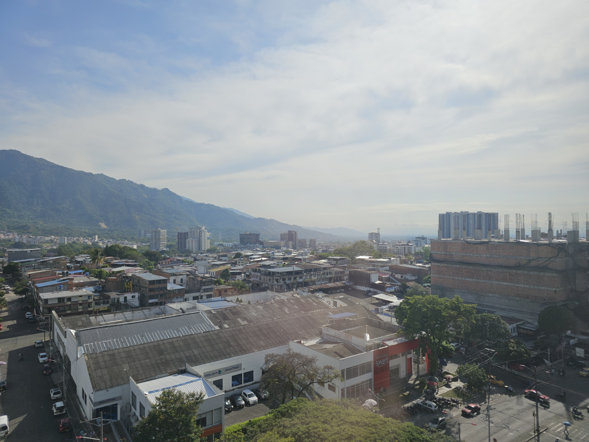
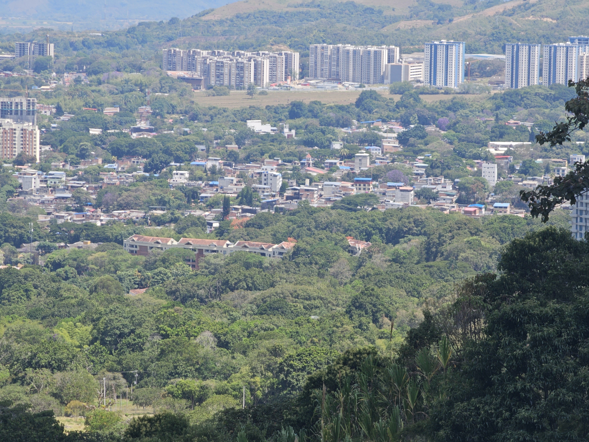

From a European perspective, the city may seem somewhat unclean and in a state of disrepair. However, compared to other cities in Colombia, Ibagué is relatively clean and, more importantly, considered safe.

As I mentioned earlier, there is a small nature reserve in Ibagué. The surrounding mountains are mostly uninhabited and difficult to access, as there are very few roads or paths leading into them.

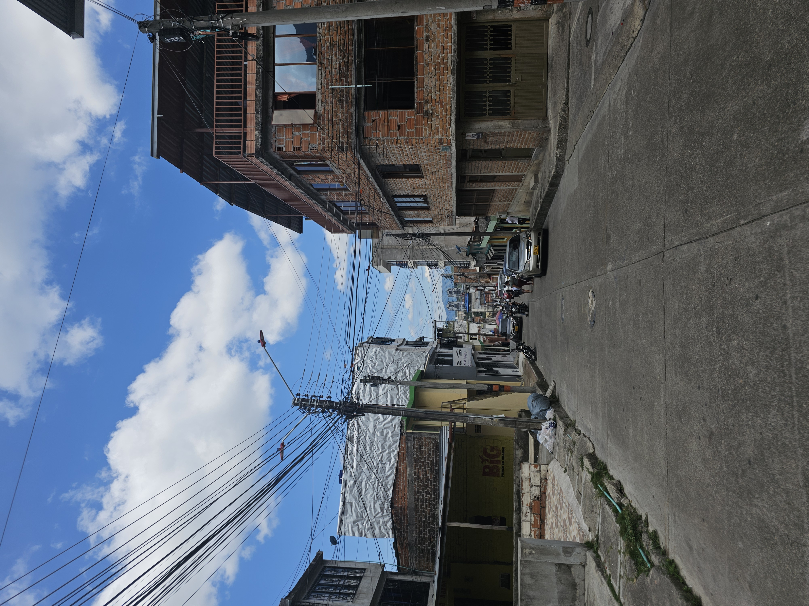
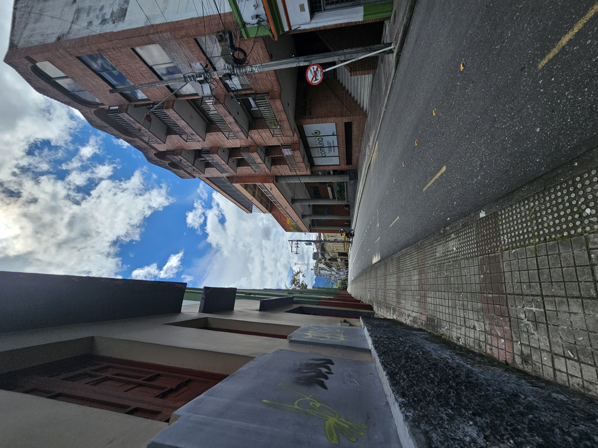

During the day, Ibagué feels safe in almost all areas you can imagine. However, at night, it is generally not recommended to go out unless you stay within the safest neighborhoods.

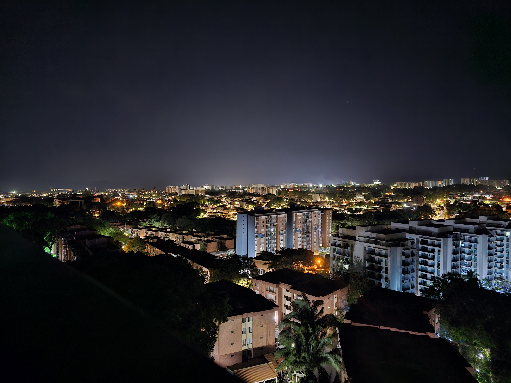

In the city center, there is a museum dedicated to the Tolima region, which interestingly used to be a prison.

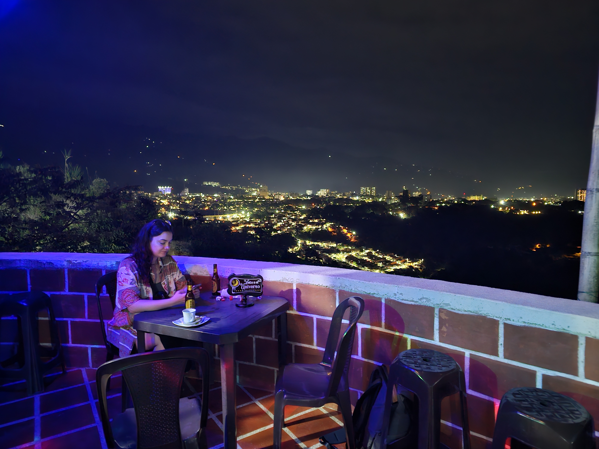
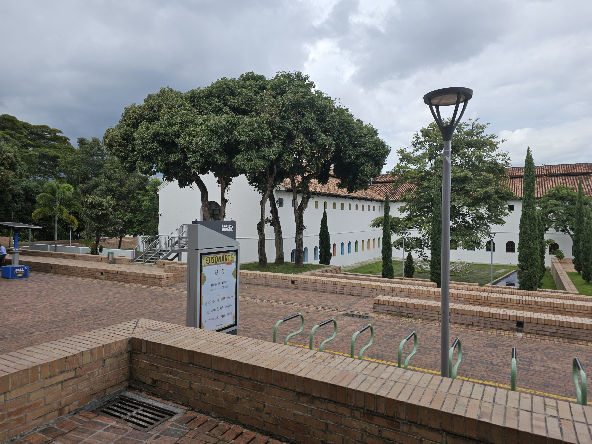

## Ibague sorounding

You can visit ibague sorounding, there is some hotel or airbnb that you can view the Ibagué city, or you can take short trip by  public city transport to canyon or to waterfalls.

Waterfalls and sourounding. The acces to the main waterfall was closed.

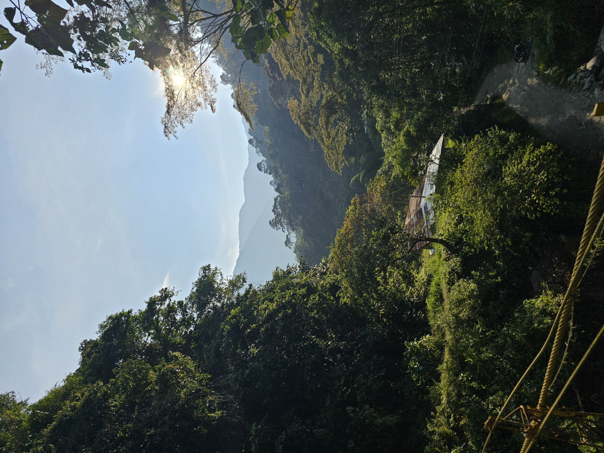

# Trips:

During my internship in Colombia, I had the opportunity to take several memorable trips, which I’d like to share here.Since I usually worked from Monday to Friday, my travel time was limited, which meant I often had to plan short weekend trips. As a result, I often planned trips that fit into my weekends. Occasionally, I would take a day or two off from work to extend my trips. These short trips allowed me to explore Colombia’s rich culture and stunning landscapes, from vibrant cities to breathtaking natural parks.

## Bogota

There is not that much to say about this trips. We just went to the ibagues bus station, buy bus ticket to bogota. Then you need to spend about 6 hours in bus to Bogota.

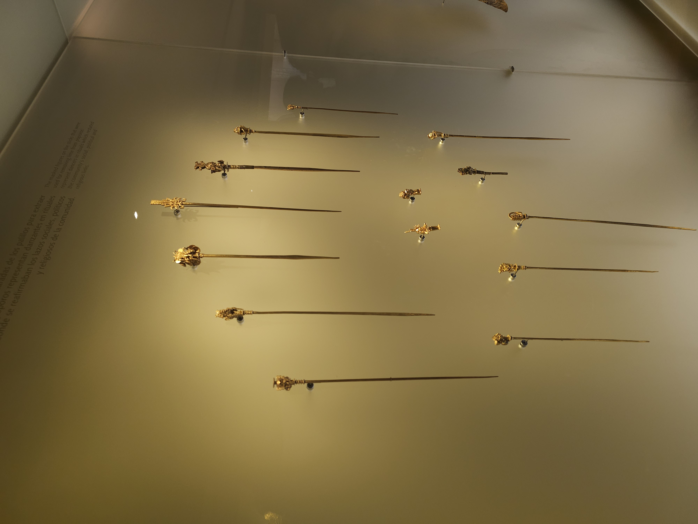

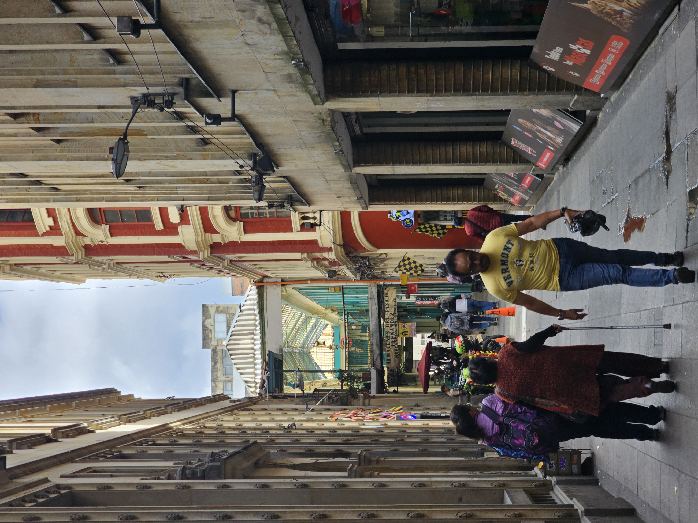



We spend only one night in Bogota so we dont have that much time to visit everything that we like to visit. So what we manage to visit:
- Museum of gold
- the peak of the hill Monserrate
- city center

Definitly the best thing was the Monserrate hill. There was so nice view on Bogota and at night it becomes even more prettier.

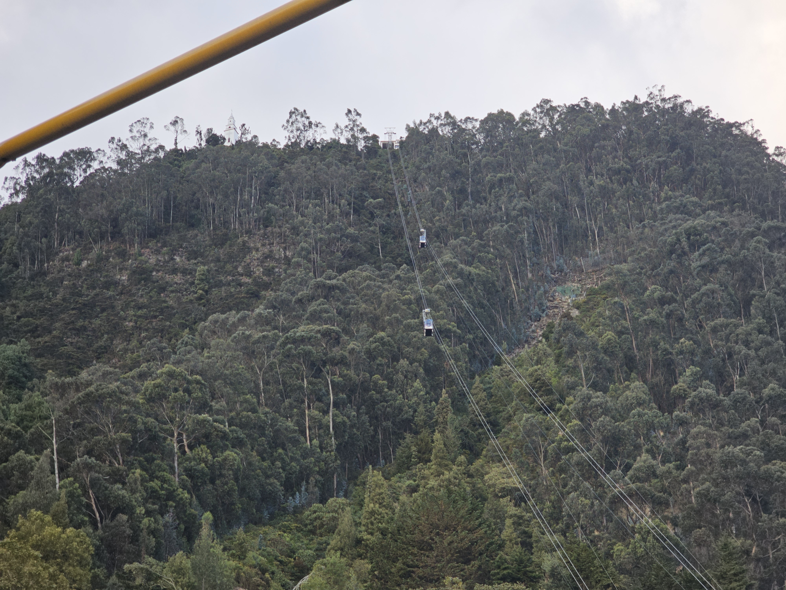
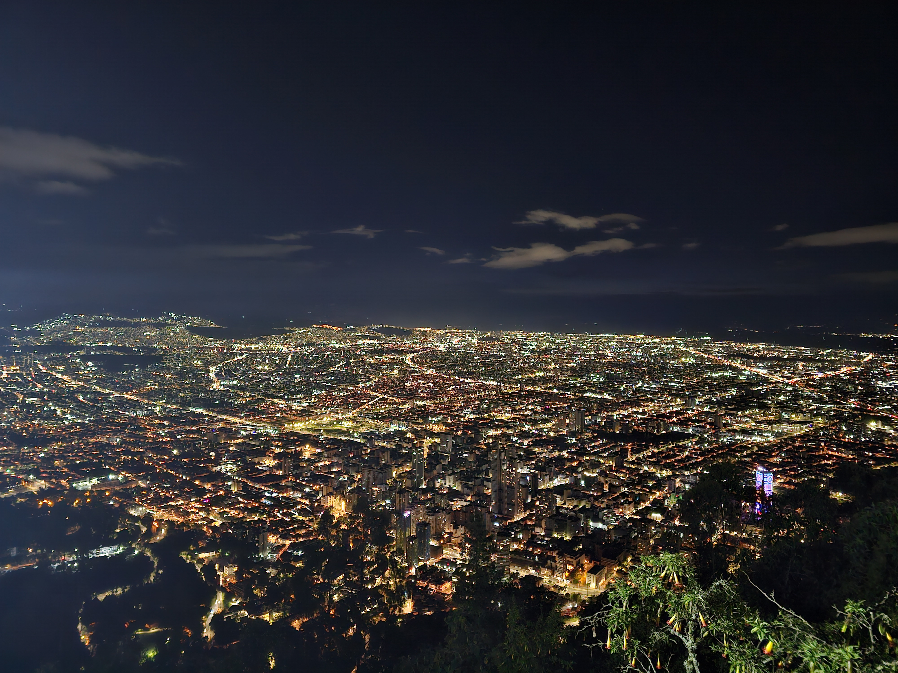

## Meledin

bus disaster

meledin

## Salento

way there
manizales

pretty but small, over crouded

not the best 

coffee trip

hikking trip

## Lake and smth

prupose

hotel

tired as f

getting homw

## Truely roundtrip mountine trip to Manizales

This was the most random trip of all the trips I've taken. On Friday, we just packed our backpacks and went to the Ibagué bus terminal. We decided that we wanted to go to a small village called Murillo. You have to take a bus to Líbano and then take something that I'd call a shuttle car.

When we got to the Murillo region, we realized that it was quite cold here—very surprising because we were at quite a high altitude. So we put on everything we had because, as the night was coming, the cold became more and more serious.

In Murillo, there was supposed to be a waterfall, but when we got almost to the place where it was supposed to be, we met some Colombian tourists. They were trying to tell us that the waterfall wasn't there, and when we asked where it was, they just answered something like "no waterfall." So there was no waterfall, even though Google Maps showed the place with at least 50 positive reviews.

We decided to move further up. That was, of course, a brilliant idea—in flip-flops and shorts. So we hired a driver to take us to some accommodation that looked very nice on the map. When we arrived, there was no one there. That was very unfortunate because we really didn't have any other option for a place to sleep. Fortunately, really late at night, someone showed up—they had a reservation, but we didn’t. Even more fortunately, the owner arrived later.

Of course, no one had any idea about English here, and what was even more challenging was that there was no cell phone service. The night here was very nice, even though it was really cold outside...

In the morning, we decided to hitchhike through the mountains as far as we could manage. It took about two hours to find someone kind enough to give us a ride. (By the way, never hitchhike in Colombia.) The only problem was that there were already five people in the car. BUT in Colombia, they don’t bother with things like how many seats are available. So, inside the car, there was a five-person family—and us. It was quite a strange experience, but very joyful. The only disadvantage was that we had to pay for the ride, and we only realized that later when we couldn’t say no.

But they helped us not be late for work because it was already Sunday. We managed to get to Manizales, but we didn’t really have much time to explore, so we just took a quick walk around the city center and then the cable car to the bus terminal. And then—a seven-hour bus ride back to Ibagué!



## Cartagena and Santa Marta

This was the longest trip to manizales. Columbia is big country, from my prespetive it havent seen like that before i was there. Thing that make columbia even biger is that the road network is in developeing stage and aditionaly that they havent found the necesities of train transport. To travel from ibague to Carabian sea you have to use either plane or more then 20 hours bus with a few transfers. Due to our limited time the plane was the clever on only option. 

Unfortunatly the flights from ibague to cartagena and santa marta were super expensive (even for european prespective) we imidiatly decided that we have to fligt from diffrent airport. The closes one is in bogota, so we again went to bogota, then we take plane to cartagena. 

cartagena

baku
uber scam
scamy place
boat transfer and 

bus ride to santamarta
santamarta

flight back

~~ The education was really focus on ML and that was strange becouse they havent been realy good programers. That was strange as well. ~~

 

