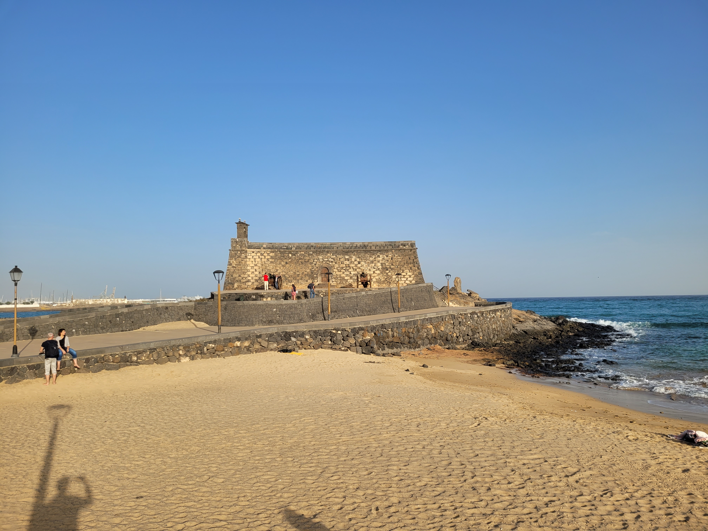
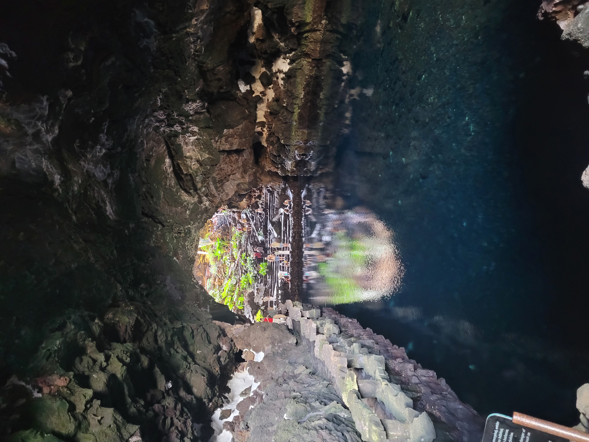
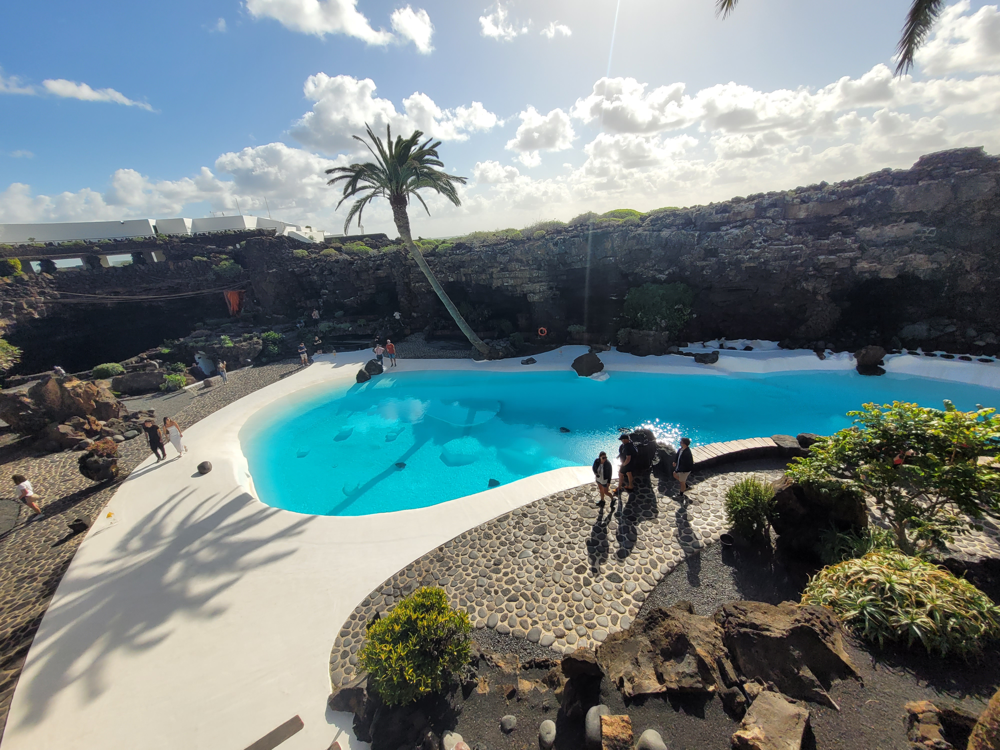
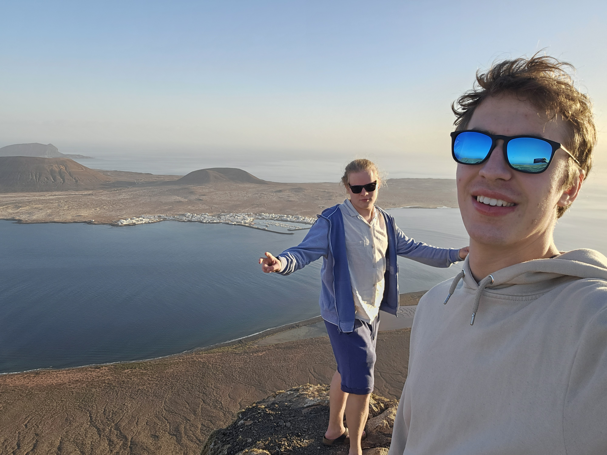
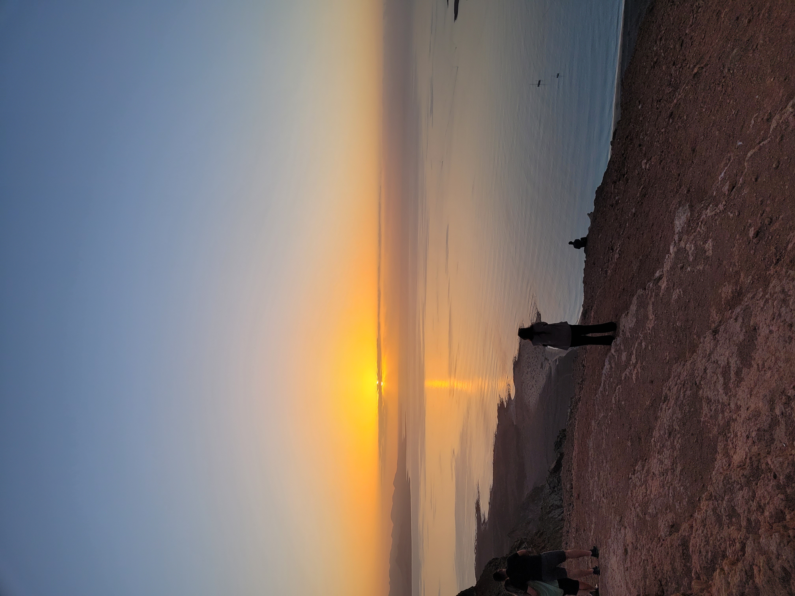
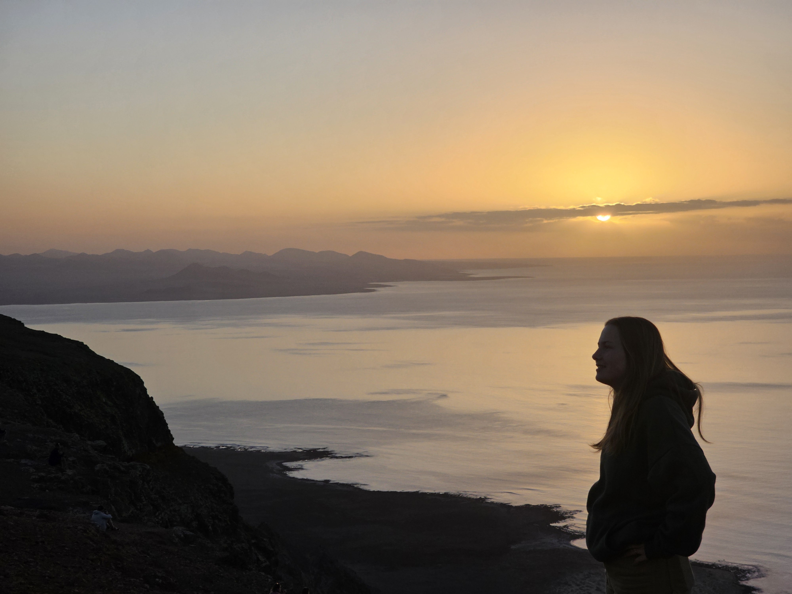

Tento článek bude trochu jiný než ostatní, které můžete najít na mém blogu. Obvykle se snažím vše naplánovat tak, abychom stihli co nejvíce za co nejméně času. Tentokrát byl výlet spíše vánočním odpočinkem. Byli jsme tentokrát větší skupina a jak se během našeho pobytu ukázalo, s větším počtem lidí sice lze dosáhnout příjemnějších cen ubytování, ale organizace může být docela problematická.

## Den nultý: Cesta
Byla to poprvé, co jsem měl možnost letět s přestupem. Oba lety jsme absolvovali s Vuelingem z Vídně s přestupem v Barceloně. Tentokrát jsem cestoval autem do Vídně, takže jsem parkování rezervoval několik dní dopředu na Pandaparken v blízkosti letiště s zajištěným odvozem na letiště a zpět.

Pokud jde o přestup, Vueling umožňuje přestupy bez jakýchkoli problémů. Udajně by na vás snad i mohli počkat, pokud by to bylo potřeba, ale to vím jen z doslechu.

Celkem jsme cestovali asi 5 hodin autem a 5 hodin letadlem, navíc jsme dvě hodiny čekali na letišti v Barceloně a další dvě na letišti ve Vídni.

Poslední část cesty na ostrově proběhla taxíkem. Taxikář neuměl česky, ale vysvětlit, že chcete taxi pro 6 lidí, není těžké i bez znalosti španělštiny. Adresu jsem ukázal na telefonu.

## Ubytování:
Standardně jsem vybral Airbnb uzpůsobené podle přání všech účastníků. Tentokrát jsme si pronajali celou vilu. Byla to vila se 4 ložnicemi, celkově až pro 11 lidí, s obrovským obývákem, krásnou kuchyní a hlavně obrovskou terasou.

## První den
Rozhodli jsme se strávit ho v podstatě odpočinkem. Došli jsme do nejbližšího obchodu, kde jsme si koupili nezbytné zásoby, a kromě toho jsme si půjčili auto. Jelikož to byla sobota, jediná možnost pro pronájem auta byla na letišti. Sehnat auto pro 6 lidí v této době nebyl problém.

Odpoledne jsme se šli projít po městě Arrecife. Město nás moc nezaujalo, ale líbilo se nám tam. Chtěli jsme se někde najíst, ale byla sobota, takže bylo skoro všechno zavřeno. Nakonec jsme prošli přes celé město až do přístavu, kde bylo několik restaurací, a udělali jsme velkou chybu, že jsme si sedli do té první. Bylo to hrozně drahé a podávané jídlo nebylo dobré. Udělal jsem chybu, že jsem se nepodíval na recenze, protože na tuto restauraci byly otřesné. Po obědě jsme došli až na konec mola s pevností. 

## Den druhý

Tento den jsme vyrazili "už" před 10:00 z našeho ubytování. Cílem byl sever ostrova, kde jsme chtěli navštívit několik památek.

První byla `Jameos del Agua`, což je jeskyně sopečného původu s jezírkem, která nás moc nezaujala a přišla nám příliš umělá. 
 
 

Hned vedle se nachází komplex sopečných jeskyní `Cueva de los Verdes`, které jsou sice hezké, ale ve srovnání s našimi nebo jinými krasovými jeskyněmi nám připadaly nudné. Průvodkyně nejprve mluvila španělsky a poté anglicky. Měl jsem problém rozeznat, kdy skončila španělská část a kdy začala anglická, protože mluvila ve stejném tónu oběma jazyky, což bylo nešťastné. Celý výklad byl tak trochu bez emocí. Zajímavé jsou jeskyně s "zrcadlovou" vodou, tak čistou, že odraz vypadá skutečně. Příjemné je, že v jeskyni je absolutně teplo.

Po prohlídce jsme pokračovali do rybářské vesničky, alespoň tak to bylo podle návodu, který jsme dostali od paní domácí, u které jsme bydleli. Vesnice byla hezká, ale spíše než rybářská nám přišla turistická. Bylo zde možné zakoupit turistické plavby po okolí nebo trajekty na vedlejší ostrov. Vedlejší ostrov jsme nenavštívili, neboť podle informací na internetu tam nic zajímavého není.

Následně jsme se kousek vrátili a šli si odpočinout na pláž `Caletón Blanco`. Kvůli silnému větru na ostrově jsou na pláži vybudované kruhy z kamenů, kde se můžete schovat. Vstup na pláž byl přes kameny, ale voda zde byla nejteplejší ze všech míst, která jsme na ostrově navštívili.

Pokračovali jsme na vyhlídku `Mirador del Río`, která patří k tomu nejkrásnějšímu, co můžete na ostrově vidět. Je to extrémně fotogenické místo, zejména při západu slunce je pohled dechberoucí. 
 
 
 

 

## Den třetí

Protože předchozí den byl náročný, rozhodli jsme se tento den trochu odpočívat. Jelikož jsem velký fanoušek letadel, šli jsme se podívat na letiště. Ne že bych je nutil, ale chtěli jít se mnou. Výhled na přistávající letadla, která nám přistávala nad hlavou, byl krásný. Na vzlety to bylo už horší, ale pořád to bylo krásné.


Vedle ranveje je i krásná pláž. 

Odpoldne jsme šli do vedlejšího města `Puerto del Carmen`, kde jsem měl aspoň malý pocit, že nejsme jediní, kdo jsou na ostrově. V Arrecife bylo úplně mrtvo. Tady to žilo a dokonce bylo i pár lidí na pláži.

## Den čtrtý

Vyrazili jsme na jiho západ ostrova. První jsme jeli na krásnou část sklanatého pobřeží `Los Hervideros`. Poté jsme pokračovali k `Zelnému jezeru` s krásnou černou pláži, ale na koupání to uplně nebylo, protože byla zima a dál v moři už to nevypadalo tak krásně. Pak jsme se přesunili na vyhlídku `Mirador del Charco de los Clicos` na jezero `Charco Verde`. Velice kouzelný výhled. 

Trochu jsme se prošli po vesničce `El Golfo` odkud by se dalo jít na nějákou delší procházku ale toho jsme nevyužili. 

