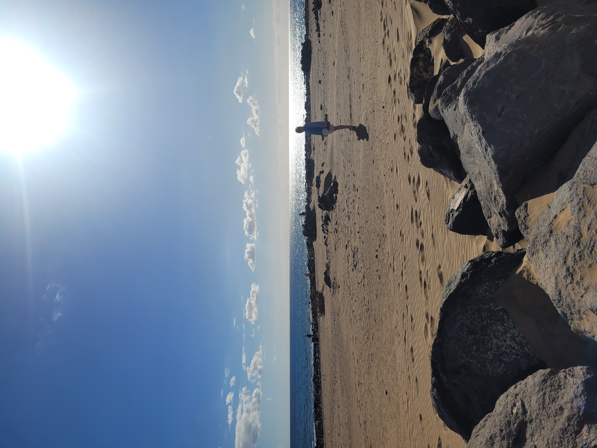

Tohle bude trochu jiné než ostatní věci co můžete najít na mém blogu. Obvykle se snažím vše naplánovat, tak aby jsme toho za co nejméne času stihli co nejvíc. Tenhle výlet byl, ale spíš vánočním odpočinutím. Tentokrát jsem byli daleko větší banda a jak se během našeho pobytu ukázalo s větším množství lidí se sice dá dostat na příjemější ceny ubytování, ale organizace může být docela problematická.

## Den nultý: Cesta
Bylo to poprvé co jsem měl možnost někam letět s přestupem. Oba lety jsem letěli s Vueling z Vídně s přestupem v Barceloně. Protože jsem tentokrát cestovali autem do Vídně rezervoval jsem parkování pár dnů do předu na pandaparken v blízkosti letiště se zajíštěným odvozem na letiště a z něj. 

Pokud jde o přestup Vueling dovoluje přestupy bez jakýchkoliv problémů. Udajně by na Vás snad i mohli počkat kdyby to bylo potřeba, ale to vím jen z doslechu. 

Celkem jsem cestovali asi 5 hodin autem a 5 hodin letadlem a navíc jsme dvě hodiny čekali na letiště v barceloně a další dvě na letišti ve Vídni.

Poslední část cesty na ostrově proběhla taxíkem. Texíkář neuměl česky, ale že chcete taxi pro 6 lidí není těžké vysvětlil i bez znalostí španělštiny. Adresu jsem ukázal na telefonu. 

## Ubytování:
Standarně jsem vybral airbnb uzpůsobené podle přání všech učastníků. Tentokrá jsme si pronajali celou vilu. Byla to vila s 4 ložnicemi celkově až pro 11 lidí. Obrovský obývák. Krásná kuchyn a hlavně krásná a obrovská terasa. 

## První den
Jsem se rozhodli že jej strávime v podstatě flákáním. Prošli jsem se do nejbližšího obchodu kde jsme si koupil nutné zásoby a krom toho jsme si pujčili auto. Protože se jendnalo o sobotu jediná možnost pro pronájemm auto byla na letšiti. Sehnat auto pro 6 lidí nebyl v této době problém. 

Odpoledne jsem se byli projít po městě Arrcife. Město nás moc nezaujalo, ale jako libilo se mi. Chtěli jsem se někde najíst, ale byla sobota, takže bylo skoro všechno zavřeno. Na konec jsme prošli přes celé město až do přístavu, kde bylo několik restauraci a udělali jsem velkou chybu, že jsme si sedli do té první. Bylo to hrozně drahé a voložené nedobré. Udělal jsem chybu, že jsem se nepodíval na recenze, protože na tuto restauraci byli otřesné. Po obědě došli jsme až na konec mola s pevností. 

## Den druhý

Tento den jsme vyrazili "už" před 10 z našeho ubytování. Měli jsme na mířeno na sever ostrova hned na několik památek.

První věcí co jsem navštivili tak byla `Jameos del Agua`, což je jeskyně sopečného původu s jezírkem. Ta nás moc nezaujala a přišla nám hodně umělá. 

Hned vedle je velký komplex taktéž sopečných jeskyních `Cueva de los Verdes`, které jsou no.... hezké, ale v porovnání s našimi nebo jinými krasovými jeskyněmi nám to připadělo nudně. Paní průvodkyně mluvila nejdřív španělsky a potom anglicky. Měl jsem problém rozeznat, kdy skončila ta špatnělská část, a kdy začala ta anglická, protože ona ve stejném tonu mluvila anglicky i špatnělsky, což je takové neštastné. Celý výklad byl takový bezemoční. Zajímaé jsou jeskyně které mají krásnou "zrdcadlovou" vodu. Tak čistou, že odraz vypadá skutečně. Co je ale přijmné, že v jeskyni je absolutní teplo.

Po prohlídce jsem pokračovali do rybařské vesničky, teda alespoň to tak bylo podle návody co jsem dostali od paní domáci, u které jsme bydleli. Vesnice byla hezká ale víc jak rybářská mi přišla jako turistická. Dali se tady koupit turistické plavby po okolí, nebo trajekty na vedlejší ostrov. Vedlejší ostrov jsem nenavštvili nebyl důvod. Podle internetu tam nic není. 

Následně jsme se kousek vrátili a šli jsem si odpočinout na pláž `Caletón Blanco`. Protože na ostrově je hodně větrno, tak na pláži jsou vybudované takové kruhy z kamenů a můžete se do nich schovat. Vstup do pláže byl přes kameny, ale byla tady nejteplejší voda ze všechn míst na celém ostrově. 

Pokračovali jsem v plánu cesty na vyhlídku `Mirador del Río`, což patří k tomu nejhezčímu co můžete na ostrově "vyhlednout". Extrémně fotogenické místo. Se západem slunce - dechberoucí. 

## Den třetí
Proto tento den byl náročně další den jsem se rozhodli trochu flákat. Protože jsem velký fanoušek letadel, šli jsme se podívat na letiště. Ne že bych je nutil, ale chtěli jít semnou :D... Krásný výhled na přistávající letadla, která nám přistávala nad hlavou. Na vzlety to bylo už horší, ale pořád krásné <3. 


Vedle runwaye je i krásná pláž.

Večer jsem šli do vedlejšího města `Puerto del Carmen`, ve ktérém jsem měl aspoň malý dojem, že nejsem jediní co jsme na ostrově. V Arrecife bylo uplně mrtvo.

## Den čtyři: 

